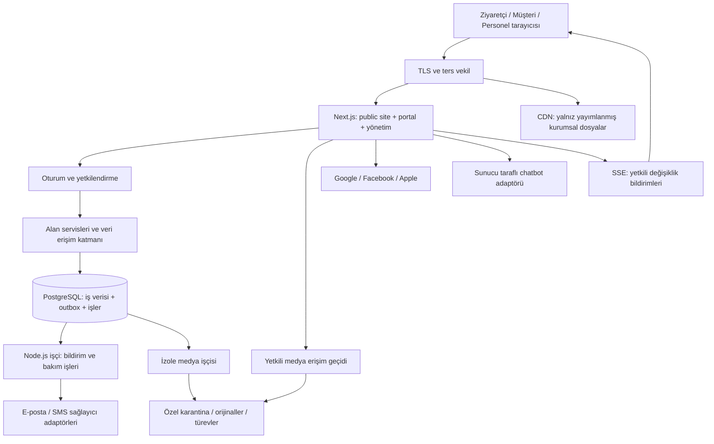

# Kiana Bahçe — Ürün, Mimari ve Ajan Uygulama Şartnamesi

**Belge sürümü:** 1.0 · **Tarih:** 1 Ekim 2026 · **Dil:** Türkçe  
**Durum:** Uygulama ajanları için başlangıç şartnamesi. Bu belge uygulamanın kurulmuş, test edilmiş veya yayına alınmış olduğu anlamına gelmez.  
**Teslim kapsamı:** Tek Markdown belge. Uygulama kodu, depo değişikliği, hesap açma, hizmet satın alma ve dağıtım bu hazırlığın kapsamında değildir.

**Okuma yolu:** Ürün için §2–4; teknik mimari için §5–9; müşteri ve iletişim süreçleri için §10–15; güvenlik için §17; uygulama sözleşmeleri için §18; kabul ve depo yönetimi için §20–21; ajanlara sırayla iş vermek için **§22**. İşletme sahibinden alınacak bilgiler **§23**'tedir. İlk kodlama görevi K00'dır; depo bilgisi verilmeden bu görev başlatılamaz.

## 1. Belgenin yetkisi ve çalışma biçimi

Bu belge ürün kapsamı, temel teknik kararlar ve kabul kriterleri için ortak referanstır. Kodlama ajanı işe başlamadan tamamını, ardından kendi görev bölümünü okumalıdır. Kullanıcının daha sonraki açık talimatı belgeyi değiştirir; ajan bu değişikliği belgeye işlemeden eski ve yeni kuralları karıştırmamalıdır.

- **Ürün sahibi:** İşletme kararları, bütçe, müşteriyle kurulacak iletişim, tasarımın kabulü ve canlıya geçiş onayı kullanıcıdadır.
- **Mimari sorumlusu / entegratör:** Ana asistan; teknik kararları, görev sınırlarını, incelemeyi ve `main` birleştirmelerini yönetir.
- **Kodlama ajanı:** Yalnızca verilen görev kimliğini uygular. Ayrı dal ve çalışma alanı kullanır; sonraki görevi kendiliğinden başlatmaz.
- **`main` kuralı:** Hiçbir ajan doğrudan `main` üzerinde geliştirme yapmaz. Entegratör de değişiklikleri bir dalda hazırlar; yalnızca kabul edilmiş değişikliklerin `main` birleştirme yetkisini kullanır.
- **Yetki gerçeği:** Bu belge Git erişim yetkisi vermez. Ayrı kimlikler ve depo korumaları kurulmadan “yalnız entegratör birleştirebilir” teknik olarak sağlanmış sayılmaz.
- **Karar değişikliği:** Güvenlik sınırı, veri modeli, bağımlılık, lisans, dış hizmet veya API sözleşmesi değişikliği gerekçeli mimari karar kaydıyla entegratöre sunulur. Sessizce farklı teknoloji seçilmez.

Bu belgede “zorunlu” kabul kapısını, “varsayılan” değiştirilebilir başlangıç kararını, “sonraki aşama” ise ilk sürüme dahil olmayan işi ifade eder. Sayısal limitler doğrulanmış işletme bilgisi değil, önerilen başlangıç ayarlarıdır.

## 2. Ürün hedefi

Kiana Bahçe'nin ziyaretçisi mekânı tanıyabilmeli, uygun tarih arayabilmeli ve talep bırakabilmelidir. Kesinleşmiş müşteri; düğününün hazırlığını, mesajlarını, bekleyen onaylarını ve belgelerini tek özel alanda takip etmelidir. Salon ekibi aynı takvim ve müşteri kayıtları üzerinden çalışmalıdır.

**Üç ürün yüzeyi:**

1. **Herkese açık site:** Mekân, hizmetler, galeri, uygunluk, ön rezervasyon, ziyaret randevusu, iletişim ve sınırlı kapsamlı chatbot.
2. **Müşteri portalı:** “Düğünüm”, gelişme panosu, sohbet, hazırlık adımları, seçim/onaylar, teklif, belgeler, ödeme takibi ve izin verilen özel medya.
3. **Yönetim paneli:** Alanlar, seanslar, takvim, başvurular, teklifler, rezervasyonlar, müşteriler, ekip, içerikler, bildirimler ve denetim kayıtları.

**Görsel yön:** Doğal zarafet; kırık beyaz, koyu yeşil ve ölçülü şampanya detayları. Gerçek mekân fotoğrafları, açık hiyerarşi, mobil kullanım ve erişilebilirlik. Bu karar tamamlanmış tasarım değildir. Nihai ekran tasarımı ayrı onaylanacaktır.

**İlk sürüm dışında:** Çevrim içi ödeme/tahsilat, hukuken nitelikli elektronik imza, WhatsApp entegrasyonu, yerel mobil uygulama, canlı görüntülü görüşme, pazarlama kampanya motoru, çok işletmeli SaaS, gelişmiş masa sürükleme editörü ve başka sağlayıcılara otomatik takvim yazclma.

## 3. Kapsam ve öncelik tablosu

| Modül | İlk sürümde yapılacak | Sonraki aşama / sınır |
|---|---|---|
| Kurumsal site | Mekân, olanaklar, organizasyon türleri, iletişim, yol tarifi, SSS | Blog ve çok dil ihtiyaca göre |
| Herkese açık galeri | Fotoğraflar, onaylı tanıtım videoları, albümler | Büyük arşivlerin toplu aktarımı ayrı iş |
| Uygunluk | Alan + tarih/seans + davetli sayısı, genel doluluk görünümü | Karmaşık paket/kaynak optimizasyonu yok |
| Ön rezervasyon | Talep, inceleme, süreli tutma, kesinleştirme, iptal | Talep göndermek kendiliğinden tarih bloke etmez |
| Ziyaret randevusu | Saat seçimi/talebi ve personel onayı | Dış takvimlerle çift yönlü senkronizasyon sonra |
| Kimlik | Google, Facebook ve Apple ile müşteri girişi; kontrollü düğün daveti | Sağlayıcı hesapları ve onayları teslimat bağımlılığıdır |
| Teklif | Sürümlü kişisel teklif, dahil hizmetler, müşteri kabul/değişiklik isteği | Teklif kabulü otomatik kesin rezervasyon veya e-imza değildir |
| Düğünüm | Son gelişmeler, yaklaşan işler, bekleyen onaylar, tarih ve sorumlu ekip | Gösterge amaçlı uydurma ilerleme yüzdesi kullanılmaz |
| Hazırlık panosu | Gelişme, yorum, kontrollü ek, müşteri/ekip ayrımı | Ekip notu müşteri paylaşımına otomatik dönüştürülmez |
| Sohbet | Kesin müşteri ile atanmış ekip arasında gerçek zamanlı mesaj | İlk sürümde sesli/görüntülü arama ve yazıyor göstergesi yok |
| Hazırlık/onay | Şablondan kontrol listesi, görev, son tarih, sürümlü onay | Karmaşık proje yönetimi aracı kurulmaz |
| Belgeler/ödemeler | Özel sözleşme/belgeler, vade planı, elle doğrulanmış ödeme kayıtları | Banka bağlantısı, kart saklama ve tahsilat yok |
| Bildirimler | Uygulama içi + tercihe göre e-posta, yönetici seçimiyle ek SMS | Tarayıcı push altyapıya uygun tutulur; ilk sürüm şartı değil |
| Davetiye yayını | Ayrı izinli yayın, takvimde kısa tanıtım, bağlantılı/açık paylaşım | Müşteri alanının kendisi yayımlanmaz |
| Özel medya | Erişim modeli ve depolama yapısı baştan; küçük ekler | Büyük müşteri albümü deneyimi sonraki aşama |
| Yönetim | Takvim, müşteri akışı, içerik, ekip yetkisi, mesajlar, SMS durumu | Gelişmiş satış raporları sonra |
| Davetli/masa planı | Veri sınırları ve genişleme noktası düşünülür | Davetli listesi, RSVP ve masa planı ikinci sürüm |

**İlk sürümün küçültülmesi gerekirse:** Güvenlik, rezervasyon doğruluğu ve özel iletişim azaltılmaz. Önce ileri galeri, rapor, push ve planlama modülleri ertelenir. Bir özellik hazır değilse canlıda yanıltıcı çalışan düğme gösterilmez.

## 4. Değişmez kurallar

| Kimlik | Kural |
|---|---|
| SEC-01 | Her özel okuma ve yazma sunucuda oturum, rol, işletme ve düğün üyeliğiyle yetkilendirilir. Arayüzde gizlemek yeterli değildir. |
| SEC-02 | Başka müşteriye ait kayıt kimliği bilinse bile kayıt, dosya, arama sonucu, bildirim veya toplam sayı sızmamalıdır. |
| SEC-03 | Özel içerik genel önbelleğe, herkese açık dosya alanına, analiz aracına veya chatbot bilgi havuzuna taşınmaz. |
| BOOK-01 | Aynı fiziksel kaynağın çakışan zamanları iki aktif tutma/kesin rezervasyon/bakım kaydıyla kapatılamaz. Son savunma veritabanıdır. |
| BOOK-02 | Ziyaretçi talebi, teklif kabulü ve kesin rezervasyon farklı işlemlerdir. |
| PUB-01 | İsim/davetiye paylaşımı varsayılan kapalıdır; içerik sürümü ve hedef kitle için açık onay gerektirir. |
| NOT-01 | İşlem başarıyla kaydedilmeden dış bildirim gönderilmez. Kaydedilmiş bildirim niyeti sistem arızasında kaybolmaz. |
| NOT-02 | SMS ağ hatası “kesin gönderilmedi” demek değildir. Belirsiz sonuç körlemesine tekrar gönderilmez. |
| MEDIA-01 | Özel medyanın küçük resmi, posteri, video parçası ve altyazısı da özel dosyadır. |
| OPS-01 | Gerçek müşteri verisi ve üretim sırları kodlama ajanlarının geliştirme/test ortamına kopyalanmaz. |
| GOV-01 | `main` birleştirmesi yalnız yetkili entegratör kimliğiyle, kontroller geçtikten sonra yapılır. |
| SCOPE-01 | Ajan yalnız kendisine atanmış görev kapsamını uygular; üretime çıkışı tamamlanmış geliştirmeyle eşitlemez. |

## 5. Mimari karar: sunucu ağırlıklı modüler monolit

**Karar:** TypeScript tabanlı tek depo; Next.js web uygulaması, ayrı çalışan Node.js arka plan işçisi, PostgreSQL ve özel nesne depolaması. Modüller kod içinde ayrılır; ilk sürümde mikroservis ağı kurulmaz.

Bu seçim, tek işletme için bakım ve dağıtım yükünü sınırlarken rezervasyon ile ilgili işlemlerin tek veritabanı transaction'ında tutarlı olmasını sağlar. Medya işçisi CPU/bellek tüketimi nedeniyle web sürecinden ayrılır. Gerekirse bildirim işçisi ve medya işçisi aynı kod tabanından farklı kuyrukları dinleyen ayrı süreçler olarak ölçeklenir.



### 5.1 Seçilen bileşenler ve açık kaynak yaklaşımı

| Alan | Karar | Gerekçe / kullanım sınırı |
|---|---|---|
| Web | **Next.js App Router + React + TypeScript strict** | Sunucu bileşenleri, sunucuda veri hazırlama, etkileşim adaları. [Next.js bileşen modeli](https://nextjs.org/docs/app/getting-started/server-and-client-components) |
| Stil | **Tailwind CSS**, erişilebilir bileşenlerde **shadcn/ui** | Marka tasarımı özelleştirilebilir; hazır bileşen davranışı yeniden icat edilmez. [Tailwind](https://tailwindcss.com/docs/styling-with-utility-classes), [shadcn/ui](https://ui.shadcn.com/docs) |
| Kimlik | **Better Auth**, PostgreSQL'de kalıcı oturumlar | Sosyal müşteri girişi ve ayrı personel giriş akışı. Hazır kimlik kütüphanesi kullanılır; OAuth/şifreleme elle yazılmaz. [Better Auth](https://better-auth.com/docs/concepts/users-accounts) |
| Veri | **PostgreSQL** | Transaction, foreign key, range constraint, satır güvenliği; rezervasyon otoritesi. |
| Veri erişimi | **Drizzle ORM + node-postgres** | Tipli sorgular; özel constraint/RLS için incelemeli SQL migration. ORM veritabanı kurallarının yerine geçmez. [Drizzle](https://orm.drizzle.team/docs/rqb) |
| Doğrulama | **Zod** | API ve ortam değişkeni şemaları; sunucu doğrulaması zorunlu. |
| Arka plan | **pg-boss** | PostgreSQL tabanlı iş kuyruğu; ilk sürümde ayrıca Redis işletme zorunluluğu yok. [pg-boss](https://github.com/timgit/pg-boss) |
| Canlı iletişim | **SSE + HTTPS POST** | Mesaj gönderimi POST, değişiklik akışı SSE. Kalıcı kayıt DB'de; SSE bir veri deposu değildir. |
| Takvim | **FullCalendar Standard**, yalnız takvim ekranlarında | Ay/hafta/liste görünümü; alan seçimi ayrı filtre. Ücretli Premium/Scheduler gerektiren görünüm seçilmez. [Lisans ayrımı](https://fullcalendar.io/license) |
| Görsel işleme | **sharp** | Boyutlandırma, güvenli yeniden kodlama, modern türevler. [sharp](https://sharp.pixelplumbing.com/) |
| Video işleme | **FFmpeg**, kontrollü yapılandırma | HLS kaliteleri, poster ve metadata; web isteği içinde çalışmaz. Derleme seçenekleri lisans kapsamını değiştirebilir. [FFmpeg lisans bilgisi](https://ffmpeg.org/legal.html) |
| Video oynatma | Yerel HLS destekleniyorsa native video; diğerlerinde **hls.js** | Kendi markalı erişilebilir kontroller; oynatıcı yalnız ihtiyaçta yüklenir. [hls.js](https://github.com/video-dev/hls.js) |
| Zararlı dosya tarama | **ClamAV** ve sıkı dosya türü doğrulama | Tarama tek başına güvenlik garantisi değildir; karantina ve izole dönüştürme ile birlikte kullanılır. [ClamAV](https://docs.clamav.net/) |
| Dosyalar | **S3 uyumlu ObjectStorage arayüzü** | Üretimde yönetilen özel depolama tercih edilir; sağlayıcı henüz seçilmez. S3 uyumluluğu arşiv özelliği var demek değildir. |
| E-posta | **Nodemailer/SMTP adaptörü** veya sağlayıcı API adaptörü | Üretimde güvenilir dış e-posta hizmeti; ilk sürümde kendi posta sunucumuzu işletmeyiz. |
| Test | **Vitest + Playwright**, gerçek PostgreSQL entegrasyon testleri | Saf kural, transaction, yetki ve kullanıcı akışı ayrı seviyelerde doğrulanır. |
| İzleme | Yapılandırılmış log + **OpenTelemetry** uyumlu ölçüm | Loglara mesaj metni, token ve dosya bağlantısı konmaz. İzleme sağlayıcısı değiştirilebilir. |
| Paket/depo | **pnpm workspace**, kilit dosyası, Node.js desteklenen LTS | Tekrarlanabilir kurulum; sürümler başlangıç görevinde uyumluluk ve güvenlik kontrolüyle sabitlenir. |

**Açık kaynak politikası:** Önce bakımı süren, belgeli ve lisansı uygun açık kaynak bileşen değerlendirilir. Kimlik, medya codec'i, kriptografi, takvim ve kuyruk sıfırdan yazılmaz. Buna karşılık Kiana'nın rezervasyon/onay mantığı alan kodudur; genel bir CRM'e zorla uydurulmaz. İlk sürüme Keycloak, ayrı headless CMS, Kafka, Kubernetes, Redis ve vektör veritabanı eklenmez; ölçülmüş ihtiyaç veya güvenlik gereği olmadan yeni servis açılmaz.

Seçili paketlerin tam sürümü ve o sürümün lisansı uygulama başlangıcında envantere kaydedilir. “Açık kaynak” sınırsız kullanım, ücretsiz SMS veya ücretsiz barındırma anlamına gelmez. FFmpeg codec/derleme lisansları ve FullCalendar Premium ayrımı özellikle kontrol edilir. Lisansı belirsiz paket, terk edilmiş oynatıcı ve ücretli özelliğe gizli bağımlılık kabul edilmez.

### 5.2 Tarayıcı yükünü sınırlama

- Tanıtım içeriği sunucuda üretilir; uygun yerlerde statik yayımlanır. Kişiye özel portal ve yönetim çıktısı istek bazlı, paylaşımsız hazırlanır.
- `use client` yalnız tarih seçici, sohbet kutusu, galeri kontrolleri gibi küçük etkileşimli sınırlarda bulunur. Kök layout bütün uygulamayı istemci uygulamasına dönüştürmez.
- Yetki, fiyat, uygunluk, rezervasyon geçişi ve chatbot araçları sunucudadır. Client props ve RSC çıktısı kullanıcıya açık kabul edilir; ham DB kaydı aktarılmaz.
- Fotoğraf yeniden boyutlandırma ve video dönüştürme sunucuda/işçide yapılır. Tarayıcı yalnız oynatır; içerik boyutu ihtiyaca göre seçilir.
- Büyük galeri, yönetim takvimi, video oynatıcı ve sohbet geçmişi sayfalı/isteğe bağlı yüklenir. Ana sayfa bunların JavaScript'ini taşımaz.
- Harita varsayılan basit yol tarifi bağlantısıdır; ağır üçüncü taraf harita ancak kullanıcı açınca yüklenir.
- Özel sayfalar, RSC yanıtları, API ve dosyalar genel CDN cache'ine alınmaz. `no-store` politikası altyapı ve framework seviyesinde test edilir.

Sunucu bileşenleri tarayıcıda sıfır JavaScript garantisi değildir. Hedef, gerekli etkileşim dışındaki işlem ve kodu kullanıcı cihazından uzak tutmaktır. [Next.js veri güvenliği rehberi](https://nextjs.org/docs/app/guides/data-security)

## 6. Modüller, kod sınırları ve önerilen depo düzeni

```text
apps/
  web/                 # Next.js sayfaları, route handler'lar, giriş noktaları
  worker/              # pg-boss: bildirim, süre dolumu, temizlik
  media-worker/        # Aynı domain sözleşmeleri, izole FFmpeg/sharp/tarama
packages/
  domain/              # Saf kurallar, durum geçişleri, hata türleri
  application/         # Use-case servisleri ve yetkili komutlar
  db/                  # Drizzle şemaları, migration, RLS, repository'ler
  auth/                # Better Auth yapılandırması ve ActorContext üretimi
  contracts/           # Zod şemaları, DTO ve olay sürümleri
  integrations/        # SMS, e-posta, depolama, LLM adaptörleri
  ui/                  # Ortak sunum bileşenleri
  observability/       # Log redaction, metrics, correlation id
tests/
  integration/         # Gerçek PostgreSQL, provider sandbox/fake
  e2e/                 # Müşteri, personel ve anonim senaryolar
  security/            # Yetki, RLS, dosya, cache, webhook kontrolleri
infra/                 # Dağıtım tarifleri; sır içermez
docs/                  # Bu şartname, karar kayıtları, işletim notları
```

**Bağımlılık yönü:** Web/worker → application → domain + repository portları. Dış sağlayıcılar integrations adaptörleridir. Domain React, Next.js, SMS veya S3 SDK'sına bağımlı olmaz. Web bileşenleri DB'ye doğrudan sorgu göndermez. Bir modül diğer modülün tablosuna rastgele yazmaz; ilgili use-case çağrılır.

**Alan modülleri:** identity, access, venue, availability, leads, booking, appointments, offers, wedding-workspace, approvals, conversations, documents, billing-ledger, notifications, media, publications, content, assistant, audit.

Server Actions ve route handler'lar ince giriş katmanlarıdır; aynı application servislerini çağırırlar. Bu giriş noktalarının tamamı dışarıdan çağrılabilir kabul edilir. Kullanılmayan GraphQL/tRPC veya ikinci bir backend framework'ü eklenmez.

## 7. Kimlik, üyelik ve rol modeli

### 7.1 Müşteri ve personel kimlikleri

**Müşteri:** Google, Facebook ve Apple; sağlayıcı kimliği `(provider, subject)` üzerinden takip edilir. Meta burada Facebook Login anlamındadır; Instagram hesabıyla genel giriş varsayılmaz. Sosyal giriş kişiye otomatik düğün erişimi vermez.

**Personel:** Davetle açılan ayrı personel kimlik alanı; parola + TOTP ve tek kullanımlık kurtarma kodları. Müşteri sosyal oturumu hiçbir koşulda personel yetkisine dönüşmez. Better Auth müşteri ve personel yapılandırmaları ayrı endpoint/cookie/table namespace kullanır; ortak e-posta bile kimlik alanlarını birleştirmez. İki yapılandırmanın adapter/migration uyumu kimlik görevinin erken teknik doğrulamasıdır.

Better Auth'un sosyal giriş akışlarının varsayılan 2FA davranışı credential akışlarıyla aynı değildir. Bu nedenle “personelin 2FA ayarı açık” kontrolü tek başına yeterli kabul edilmez. Yönetim servisleri doğrulanmış personel oturumu ve tamamlanmış MFA aşamasını sunucuda şart koşar. [2FA davranışı](https://better-auth.com/docs/plugins/2fa)

**Zorunlu kurallar:**

1. E-posta eşleşti diye farklı sosyal hesaplar kendiliğinden birleştirilmez. Bağlama, mevcut hesaba giriş + yeniden doğrulama + yeni sağlayıcı doğrulaması gerektirir.
2. Apple gizli e-posta adresi veya Facebook'tan e-posta gelmemesi hata varsayımıyla hesap sahipliğine dönüştürülmez. İletişim adresi ayrıca doğrulanabilir; kimlik anahtarı e-posta değildir.
3. Hesap açılması, telefon doğrulanması ve düğün üyeliği üç farklı durumdur. Telefon doğrulaması bir düğünün sahibi olduğunu kanıtlamaz.
4. Düğün daveti yüksek entropili, DB'de hash'i tutulan, süreli ve tek kullanımlık token'dır. Varsayılan 48 saat. Giriş yapan hesap + davetin hedef iletişim kanalının kanıtı + atanan rol birlikte kontrol edilir. Davet token'ı tek başına devredilebilir kalıcı erişim sağlamaz.
5. Müşteri telefonu E.164 biçiminde tutulur. SMS doğrulamasında süre, deneme limiti ve gönderim kotası vardır. OTP düz metin loglanmaz.
6. Oturum cookie'si HttpOnly/Secure olur; SameSite ve callback ayarları sağlayıcıya uygun test edilir. Sosyal callback için gerekli istisna bütün uygulamada CSRF korumasını gevşetmez. Token localStorage'da tutulmaz.
7. Sunucuda oturum iptali, cihaz/oturum listesi ve hesabı kilitleme vardır. İlk personel kurulumu tek kullanımlık güvenli bootstrap ile yapılır; varsayılan parola veya herkese açık admin kayıt ekranı yoktur.
8. MFA sıfırlama ve hesap kurtarma denetlenebilir sahiplik doğrulaması gerektirir. Destek personeli yalnız e-posta/telefon bilerek müşteriye erişim veremez.

Apple hizmet kimliği, domain/callback kaydı, anahtar yaşam döngüsü; Facebook uygulama erişimi ve Google OAuth yapılandırması üretim önkoşullarıdır. Dış hesap açma, inceleme, ücret veya onay süreleri kod tesliminin içinde garanti edilmez. Sağlayıcı giriş ve hesap silme bildirimleri ilgili güncel dokümanlara göre işlenir. [Apple](https://better-auth.com/docs/authentication/apple), [Facebook](https://better-auth.com/docs/authentication/facebook), [Hesap bağlama](https://better-auth.com/docs/concepts/users-accounts)

### 7.2 Roller ve izinler

| Rol | Kapsam | Varsayılan yetki |
|---|---|---|
| Anonim ziyaretçi | Yayımlanmış içerik | Genel site, anonim uygunluk, izinli davetiye, talep formu |
| Kayıtlı aday | Kendi hesabı ve başvurusu | Kendi talebi, randevusu, kendisine sunulan teklif; kesin müşteri panosu yok |
| Çift üyesi | Davetle bağlandığı düğün | Pano, sohbet, plan, izin verilen belge/ödeme; kendi tercihleri |
| Yakın / yardımcı | Düğüne özel açık izin seti | Varsayılan yalnız plan ve seçili pano; belge/ödeme/özel sohbet yok |
| Koordinatör | Atandığı düğünler | Hazırlık, müşteri iletişimi, sınırlı medya; SMS ayrıca izin gerektirir |
| Rezervasyon görevlisi | İşletme rezervasyon kapsamı | Talep, takvim, tutma, teklif; fiyat istisnası ve kesinleştirme ayrı izin |
| Finans görevlisi | Finans kayıtları | Ödeme planı ve kayıt; özel sohbet/galeri otomatik verilmez |
| İçerik editörü | Kurumsal yayınlar | Genel site ve kurumsal galeri; müşteri verisi yok |
| İşletme yöneticisi | İşletme | Operasyon, atamalar, onaylar, limitler; personel hesabı MFA'lı |
| İşletme sahibi | İşletme | Personel yetkileri, sağlayıcı ayarları, kritik kurtarma ve denetim |

Roller izin paketidir; kaynak kapsamını kaldırmaz. `booking.confirm`, `notification.sms.send`, `publication.publish`, `finance.record`, `member.invite`, `export.private`, `staff.manage` gibi izinler açık tanımlanır. Bir hesabın rolü kadar hangi işletme/düğüne eriştiği de kontrol edilir. Geliştirici/entegratör rolü üretim müşteri verisine varsayılan erişim değildir.

Yakın daveti ilk sürümde kapalı özellik bayrağıyla durabilir; şema rol/izin ayrımını desteklemelidir. İki çift üyesi ayrı hesaplarla bağlanır; ortak parola kullandırılmaz. Mali/önemli onay için belirlenen yetkili kişi gereklidir; bütün üyeler otomatik olarak sözleşme onaylayıcısı olmaz.

## 8. Veri modeli

Tek işletme ile başlanır; alan tablolarında `organization_id` bulunur. Bu gelecekte genişleme ve yanlış eşleşme savunması içindir; ilk sürümde çok işletmeli ürün geliştirilmez. Kayıt kimlikleri tahmin edilmesi zor olabilir fakat güvenlik bunlara dayanmaz.

| Varlık | Temel alanlar / ilişkiler |
|---|---|
| `organization` | İsim, timezone, iletişim, ayar sürümü |
| `venue_space`, `resource`, `space_resource` | Satılabilir alanlar, fiziksel çakışma kaynakları, kapasite ve aktiflik |
| `session_template`, `opening_rule` | Yerel saat başlangıç/bitiş, tampon süre, çalışma/tatil düzeni |
| `customer_user`, `staff_user` | Ayrı kimlik alanları; auth tabloları kütüphane şemasıyla yönetilir |
| `staff_membership`, `staff_assignment` | İşletme rolü, düğün ataması, izinler |
| `lead`, `reservation_request` | İletişim, istenen tarih/alan, davetli sayısı, kaynak, durum |
| `appointment` | Ziyaret saati, süre, atanmış personel, durum |
| `wedding_event`, `event_member` | Özel müşteri çalışma alanı, etkinlik durumu, üyelik/izin/iptal |
| `booking`, `resource_allocation`, `resource_closure` | Etkinlik ve booking durumu; kaynak başına bloke zaman aralığı ve `blocking`; bakım/kapanış kayıtları |
| `booking_change`, `status_history` | Tarih değişikliği önerileri, geçiş gerekçeleri ve sürüm |
| `offer`, `offer_version`, `offer_line` | Teklif, değişmez teklif sürümü, hizmet/tutar/dahil olanlar |
| `task_template`, `wedding_task` | Şablon sürümü, düğüne kopyalanan görev, sorumlu, vade, durum |
| `board_post`, `board_comment`, `internal_note` | Müşteri panosu ve yorum; iç not ayrı tablo/use-case |
| `approval_request`, `approval_decision` | Onaylanacak değişmez sürüm, yetkili kişiler, karar ve zaman |
| `conversation`, `conversation_member`, `message` | Düğün bağlamlı sohbet, alıcı kapsamı, istemci mesaj anahtarı, sıra |
| `document`, `document_version` | Özel belge, sürüm, erişim grubu, medya referansı |
| `payment_schedule`, `payment_entry` | Vade planı, ödeme/tahsis/ters kayıt; para birimi ve küçük birim tutarı |
| `media_asset`, `media_variant`, `album`, `album_item` | İşleme durumu, sahiplik, erişim, türevler, object key, boyut/hash |
| `upload_intent` | Yükleyen aktör, üst varlık, karantina anahtarı, boyut/tür sınırı, son tarih, doğrulanmış object sürümü |
| `media_restore_job`, `retention_policy` | Arşiv geri çağırma, maliyet/limit, saklama kuralı |
| `invitation_publication`, `publication_version`, `publication_consent` | Ayrı yayımlanabilir DTO, görünürlük, sürüm, onaylar, token hash |
| `notification_preference`, `notification`, `delivery` | Kullanıcı tercihi, uygulama içi kayıt, kanal/alıcı başına gönderim durumu |
| `outbox_event`, `webhook_receipt`, `idempotency_record` | Kalıcı yan etki niyeti, webhook tekilleştirme, komut tekrarları |
| `realtime_inbox` | Kullanıcıya göre artan sıra ve asgari değişiklik bildirimi; sınırlı saklama |
| `content_page`, `content_revision`, `faq_entry` | Kontrollü yapılandırılmış içerik, taslak/yayın, chatbot onaylı bilgi |
| `audit_event`, `consent_record`, `deletion_request` | Denetim, amaç/sürüm bazlı tercih ve veri yaşam döngüsü |

### 8.1 Veri bütünlüğü

- Düğüne bağlı çocuk kayıtlar `organization_id` ve `event_id` taşır. Composite foreign key veya eşdeğer DB constraint, farklı işletmenin ebeveynine bağlanmayı engeller.
- Aktör kimliği `customer|staff|system` türüyle birlikte tutulur. Farklı kimlik alanlarında eşit ID bulunması aynı kişi anlamına gelmez; actor referansları, audit ve idempotency kapsamı bu türü içerir.
- Zamanlar `timestamptz` ile saklanır; işletme timezone'u varsayılan **Europe/Istanbul** olarak önerilir ve kurulumda doğrulanır. Yerel düğün günü ayrıca türetilir; gece yarısını aşan seans desteklenir.
- Para kayan nokta değildir: küçük para biriminde tam sayı + ISO para birimi. Varsayılan TRY önerisi işletme tarafından doğrulanır. Para birimleri sessizce toplanmaz.
- Kritik düzenlemelerde `version` ile iyimser eşzamanlılık; eski sürüm güncellemesi `409` döndürür. Rezervasyonda buna ek DB kilidi/constraint bulunur.
- Müşteri ve sistem enum'ları kontrollüdür. Kullanıcıdan gelen `status`, `role`, `organization_id` veya `visibility` doğrudan toplu nesne güncellemesine verilmez.
- İndeksler: kaynak+zaman çakışması; etkinlik+oluşturulma zamanı; konuşma+mesaj sırası; kullanıcı+bildirim durumu; outbox işlenme zamanı; sağlayıcı+mesaj kimliği.
- Sayfalama anahtarlı/cursor tabanlıdır. Portal listelerinin varsayılan sayfa boyutu 20, üst sınırı 100'dür. Kamu sorgularında tarih aralığı en fazla 31 gün; sınır sunucuda uygulanır.
- Üretimde şema senkronize eden “push” komutu kullanılmaz; sürümlü migration incelenir. Geriye uyumlu genişlet → veri taşı → daralt yaklaşımı tercih edilir.

## 9. Rezervasyon ve uygunluk motoru

### 9.1 Alan, seans ve fiziksel kaynak

Bir “bahçe” ile “salon” aynı anda bağımsız kullanılabilir veya ortak sahne/mutfak gibi bir kaynağı paylaşabilir. Bu bilgi henüz verilmediği için gerçek alan sayısı uydurulmaz. Kurulum, tek alanla başlayabilen **çok alan/seans destekli** yapılır.

Her satılabilir alan, kapatması gereken atomik fiziksel kaynaklara eşlenir. Birleştirilebilen A+B alanı seçildiğinde hem A hem B bloke edilir. Ortak kapasitesi birden fazla olan kaynak optimizasyonu ilk sürüm dışıdır; bir kaynak tek kullanımlık çakışma birimidir. Kaynak haritası gerçek işletme düzenine göre onaylanır.

Bloke aralık, etkinlik başlangıç/bitişine kurulum ve temizlik tamponlarını ekler. Aralık **[başlangıç, bitiş)** biçimindedir. Bitişle bir sonraki başlangıcın eşitliği, tamponlar dahil hesaplandıktan sonra çakışma sayılmaz. Kapasite yalnız davetli sayısı için kontrol edilir; seans süresi ve kaynak uygunluğu ayrıca denetlenir.

### 9.2 Durum makineleri

| Nesne | Durumlar ve geçişler |
|---|---|
| Talep | `new → reviewing → offered → converted`; alternatif `declined / withdrawn` |
| Tutma/rezervasyon | `held → confirmed`; `held → expired / cancelled`; `confirmed → completed / cancelled` |
| Teklif sürümü | `draft → sent → accepted / declined / expired / superseded` |
| Tarih değişikliği | `proposed → customer_accepted → applied`; alternatif `rejected / withdrawn / conflict` |
| Ziyaret randevusu | `requested → confirmed → completed`; alternatif `cancelled / no_show` |

Talep ve teklif tarih kapatmaz. `held` yönetici yetkisiyle açılır; varsayılan süre **24 saat**, işletme ayarıyla değişir. Uzatma izinli, gerekçeli ve kayıtlara işlenen işlemdir. Sonlu `expires_at` zorunludur; sonsuz tutma yapılmaz.

Kesinleştirme; yetkili personelin açık komutuyla, gereken teklif/sözleşme/kapora kontrol listesi tamamlanınca yapılır. İşletmenin belge ve kapora şartları henüz belli değildir; şema bunları ayarlanabilir tutar. İstisna yalnız özel yetki ve gerekçeyle kaydedilir. Chatbot veya müşteri teklif kabulü doğrudan `confirmed` üretemez.

### 9.3 Çakışmayı engelleyen transaction

1. Actor ve `booking.hold` / `booking.confirm` / `booking.reschedule` izni doğrulanır.
2. İdempotency anahtarı aktör+komut+payload hash'iyle doğrulanır. Aynı anahtar farklı içerikle kullanılırsa reddedilir.
3. İlgili kaynak satırları sabit sırada kilitlenir; mevcut rezervasyon değiştirilirse o kayıt da kilitlenir.
4. Kilitler alındıktan sonra tek bir DB karar zamanı alınır (`clock_timestamp` sonucunun sabitlenmiş değeri). Bu kaynaklardaki süresi dolmuş tutmalar aynı transaction'da `expired` yapılır ve blokları kaldırılır. Kilit beklemesinden önce alınmış transaction zamanı süre denetiminde kullanılmaz.
5. Çalışma kuralı, kapasite, zaman aralığı, tampon ve aktif bloklar yeniden kontrol edilir.
6. Her kaynak için allocation yazılır/güncellenir. PostgreSQL GiST exclusion constraint, aynı `organization_id + resource_id` için `blocking = true` aralıkların kesişmesini reddeder. `btree_gist` kurulumu migration görevidir.
7. Domain kaydı, durum geçmişi, audit ve outbox aynı transaction'da yazılır; commit sonrası dış işler yürür.
8. Conflict güvenli `409 SLOT_UNAVAILABLE` döndürür; karşı müşterinin adı veya booking kimliği dönmez.

Exclusion predicate'ine `expires_at > now()` konmaz. Zamanla kendiliğinden değişen index üyeliği kurulmaz; `blocking` kalıcı durum alanıdır. Süre dolumu işçisi temizler, ayrıca yeni yazma akışı bunu senkron olarak uygular. Worker durursa süresi dolan kayıtlar satış yolunu kalıcı kapatmaz. Public okuma aktiflik hesabını aynı zaman kuralıyla yapar; son karar her zaman yazma transaction'ındadır. [PostgreSQL range constraint](https://www.postgresql.org/docs/current/rangetypes.html), [index ifadeleri](https://www.postgresql.org/docs/current/sql-createindex.html)

**Tarih taşıma:** Yeni alan/zaman ile eski allocation'lar aynı transaction'da değiştirilir. Yeni slot alınamazsa rollback eski rezervasyonu korur. Önce eski tarihi bırakıp sonra yenisini almaya çalışma yapılmaz. Çok kaynaklı işlem ya tamamen başarılıdır ya tamamen geri alınır. Kullanıcının onayladığı değişiklik sürümü taşımaya esas alınır.

### 9.4 Kamuya açık uygunluk

- DTO yalnız `space`, `slotStart`, `slotEnd`, `availability: available|unavailable|closed` ve izinli yayın varsa `publicPublicationId` taşır.
- `held`, bakım, özel kullanım gibi iç gerekçeler ziyaretçiye müşteri bilgisi vermeden “uygun değil” olarak gösterilebilir. `unavailable` kayıtları müşteri listesini döndürmez.
- Kamu arayüzü varsayılan en fazla 18 ay ileriyi arar; gerçek satış ufku işletme ayarıdır. Gün, alan ve seans ayrımı korunur; bir seans dolu diye bütün gün dolu gösterilmez.
- Uygunluk hafif sorgudur; kısa zamanlı teknik önbellek kullanılırsa en fazla 15 saniye ve yalnız anonim DTO için. Ekranda uygun görünmesi kesin rezervasyon garantisi değildir.
- Müşteri adı izin verilmedikçe API, HTML, RSC, tooltip, DOM veri alanı, takvim dışa aktarımı veya analitik olayında bulunmaz.

### 9.5 Ziyaret randevusu ve bakım blokları

Ziyaret talebi personel takvimini otomatik kapatmaz. Kesin randevu, gereken personel ve ziyaret alanını kaynak olarak ayırır; aynı fiziksel kaynak gerçekten kullanılıyorsa düğün rezervasyonuyla da çakışma kontrolüne girer. `resource_allocation`, tam olarak bir `booking`, `appointment` veya `resource_closure` sahibine bağlıdır; XOR/check ve foreign key kuralları uygulanır. Müşteri düğün rezervasyonu gerektirmeyen randevu/bakım satırlarında `event_id` boş olabilir; bunların yetkisi işletme/personel kapsamında ayrıca tanımlanır. Randevu süresi ve personel vardiyaları ayarlanabilir; gerçek süreler uydurulmaz.

## 10. Müşteri yolculuğu ve düğün çalışma alanı

### 10.1 Başvurudan müşteriye

Ziyaretçi uygunluk bakar → iletişim bilgili talep bırakır → personel talebi inceler → gerekiyorsa ziyaret ve teklif hazırlanır → yetkili personel süreli tutma açar → şartlar tamamlanınca kesinleştirir → müşteriye düğün üyelik daveti gider → müşteri giriş yapıp daveti kabul eder.

Form başarılı gönderildiğinde referans ve “talep alındı” mesajı gösterilir; “rezervasyon tamamlandı” denmez. Login zorunlu olmadan talep bırakılabilir, ancak bu talep sonradan hesaba e-posta eşleşmesiyle otomatik bağlanmaz. Sahiplik doğrulaması gerekir. Spam koruması, hız sınırı ve kontrollü çift kayıt eşleştirmesi bulunur.

### 10.2 Düğünüm ekranı

Tarih/alan, sorumlu ekip, son müşteri gelişmeleri, yaklaşan üç görev ve bekleyen onaylar gösterilir. Gecikmiş işler açıklanır; bilinmeyen hizmet veya hazırlık yüzdesi uydurulmaz. İptal edilen etkinlik yazmaya kapatılabilir; erişim ve saklama politikası ayrı uygulanır.

### 10.3 Pano, ekip notu ve yorum

- Müşteri paylaşımı `board_post` olarak; ekip notu ayrı `internal_note` olarak yazılır. Ortak editörde varsayılan iç nottur; hedef kitle daima görünürdür.
- İç notu paylaşmak bir görünürlük bayrağını çevirmek değildir: seçilen içerikten yeni müşteri paylaşımı hazırlanır, önizlenir ve açıkça yayımlanır. İç yorum zinciri aktarılmaz.
- Pano paylaşımı taslak/yayımlanmış/geri çekilmiş durum taşır. Güncelleme sürümlenir; önemli değişiklik yeni bildirim sebebidir.
- Yorumlar üst kaydın erişimini aşamaz. Özel ekler üst kaydın erişim politikasına bağlıdır. Geri çekilen paylaşımın ekleri eski bağlantıyla açılmaz.
- İlk sürümde düz metin veya izinli sınırlı zengin metin kullanılır. Serbest HTML, script ve kullanıcı iframe'i kabul edilmez.

### 10.4 Hazırlık, seçim ve onay

Görev şablonu düğüne kopyalanır; şablon sonraki değişiklikte eski düğünleri sessizce değiştirmez. Menü, dekorasyon veya oturma planı önerisi değişmez bir sürüm olarak sunulur. Müşterinin kararı o sürüme bağlanır.

`draft → awaiting_customer → approved / changes_requested → superseded` akışı uygulanır. İçerik değişirse eski onay yeni sürüm için kullanılamaz. Onaylayan kişinin o anda yetkili olduğu doğrulanır. Uygulama onayı hukuken nitelikli elektronik imza olarak adlandırılmaz.

### 10.5 Teklif, sözleşme ve ödeme

Teklif satırları, dahil/harici hizmetler, davetli sayısı, tutar, geçerlilik tarihi ve koşullar sürümlenir. Kabul edilen sürüm saklanır. Belgeler özel dosyalardır; personel veya müşteri yalnız izinli belgeyi görür.

Ödeme planı takip amaçlıdır. Tahsilat kaydı finans yetkilisince doğrulanır; müşterinin yüklediği dekont otomatik ödeme kanıtı sayılmaz. Geçmiş ödeme silinip değiştirilmez; düzeltme ters kayıt ve yeni kayıtla yapılır. Sözleşme/finans düzenlemeleri yetki, gerekçe ve audit gerektirir.

## 11. Gerçek zamanlı sohbet

**Karar:** Düğün başına müşteri konuşması; mesaj gönderimi yetkili POST ile kalıcı DB kaydına, yeni kayıt bildirimi SSE üzerinden tarayıcıya gider. Personel iç sohbeti müşteri konuşmasıyla birleştirilmez. İlk sürümde yakın rolü müşteri sohbetine otomatik üye olmaz.

- Mesaj kaydedilmeden “gönderildi” işareti verilmez. `clientMessageId + sender + conversation` tekilliği tekrar tıklama/ağ tekrarında kopyayı önler.
- Sıra sunucu tarafından verilir; istemci saati sıralama otoritesi değildir. Mesaj geçmişi cursor ile alınır; başlangıçta en son 30 mesaj.
- Konuşma sırası, conversation satırı kilitli transaction içinde atanır. Kullanıcı realtime inbox sırası da kullanıcıya ait sayaç satırı üzerinden kilitle ve ekle işlemiyle üretilir; böylece daha küçük sıra sonradan commit olup cursor arkasında kaybolmaz. Yalnız auto-increment kimliğinin commit sırasını garanti ettiği varsayılmaz.
- SSE ilk bağlantıda, yeniden bağlantıda ve akış boyunca üyelik/oturum kontrol eder. Yetki iptalinde kanal kapatılır; her event gönderimi güncel kapsamı doğrular.
- Akışta ham mesaj/gizli içerik yerine değişiklik kimliği ve sıra taşınır; tarayıcı içeriği yetkili endpoint'ten alır. Yalnız kullanıcıya ait değişiklikler yayımlanır.
- `Last-Event-ID` sunucu tarafında kullanıcıya göre kapsamlanır. Başka kullanıcının sırası başka kullanıcı akışına erişim vermez.
- Kalıcı `realtime_inbox`, yeniden bağlanınca kaçırılan değişiklikleri tamamlar. Önerilen saklama 7 gün; daha eski cursor için tam yetkili özet yenilenir.
- PostgreSQL `LISTEN/NOTIFY` yalnız uyandırma sinyali olarak kullanılabilir; tek kalıcı teslimat kanalı değildir. Her sunucu örneği kendi bağlı istemcilerini uyandırır.
- İşlem sonrası outbox gecikmesi izlenir. Proxy SSE buffering kapalı, bağlantı limitleri ve heartbeat yapılandırılmış olmalıdır. Uzun bağlantı desteklemeyen host bu tasarım için seçilmez.
- Bağlantı düşerse “yeniden bağlanıyor” gösterilir. Gerekli durumda görünür sekmede düşük sıklıklı fallback sorgu; sürekli agresif polling yoktur.
- Bildirim yoğunluğu için peş peşe mesajların e-postası birleştirilebilir. Yönetici SMS seçimi olmadan her sohbet mesajı SMS üretmez.

Bu iletişim, son kullanıcılar arasında uçtan uca şifreli olarak pazarlanmaz. TLS ve depolama koruması vardır; yetkili salon ekibi hizmet gereği konuşmayı görebilir.

## 12. Bildirim, e-posta ve yönetici seçimiyle SMS

### 12.1 Kanal politikası

| Olay | Uygulama içi | E-posta | SMS |
|---|---|---|---|
| Yeni müşteri pano paylaşımı | Evet | Müşteri tercihi | Yönetici ayrıca seçerse |
| Yeni sohbet mesajı | Evet | Tercihe göre, kısa birleştirme aralığıyla | Varsayılan hayır; yetkili ayrı bildirim komutu |
| Onay bekleyen seçim | Evet | Tercihe göre | Yönetici ayrıca seçerse |
| Ön rezervasyon/ziyaret durumu | Hesabı varsa | Doğrulanmış iletişim ve hizmet tercihi | Yönetici ayrıca seçerse |
| Tarih değişikliği/kesinleştirme | Evet | Hizmet bildirimi ayarına göre | Yönetici ayrıca seçerse |
| Ekip içi not | Yalnız yetkili personele | Personel tercihi | Müşteriye gönderilmez |
| OTP/güvenlik bildirimi | Uygun olan olayda | Güvenlik akışına göre | Yalnız ilgili doğrulama akışında; genel SMS kutusundan bağımsız |
| Kampanya/tanıtım | İlk sürüm kapsamı dışı | İlk sürüm kapsamı dışı | İlk sürüm kapsamı dışı |

**Temel davranış:** Normal işlemlerde uygulama içi bildirim ve ayara bağlı e-posta. Yönetici işlem ekranında varsayılan işaretsiz **“Ayrıca SMS gönder”** kutusunu seçebilir. Bu seçim normal kanal ayarlarını değiştirmez; o işleme ait ek gönderim isteğidir. SMS izni olmayan personelde kontrol gösterilmez ve API de reddeder.

### 12.2 Yönetici gönderim deneyimi

1. İşlemin hedef kitlesi belirlenir: ekibe özel / müşteri / izinli kamu yayını.
2. Yönetici SMS seçerse gerçek alıcılar, doğrulanmış numaralar, metin ve tahmini SMS parça sayısı gösterilir. Kayıtlı kişilerin gereksiz verisi gösterilmez.
3. Metin varsayılan olarak güvenli şablondur: “Kiana Bahçe hesabınızda onayınızı bekleyen bir güncelleme var.” Bağlantı giriş gerektiren kendi alanına gider; giriş atlatan token içermez.
4. Özel açıklama, ödeme tutarı, belge adı, mesaj metni gibi bilgiler varsayılan SMS/e-posta önizlemesine alınmaz. Personelin serbest toplu SMS yazması ilk sürüm dışıdır.
5. İşlem kaydı ve SMS niyeti aynı transaction'da saklanır. Dış SMS API'si transaction sırasında çağrılmaz.
6. Arayüz “işlem kaydedildi, SMS gönderim sırasına alındı” der. Sağlayıcıya kabul edilmeden “SMS ulaştı” denmez.

Önizleme sürümü; alıcı kümesi, şablon sürümü ve işlem sürümüyle bağlanır. Kaydetme anında bunlardan biri değişmişse yeniden önizleme gerekir. Telefon değiştirme, üyelik iptali, tercih veya gönderim yetkisi değişikliği worker tarafından gönderimden hemen önce de kontrol edilir.

### 12.3 Tercihler, maliyet ve sessiz saatler

- Bildirim tercihleri olay kategorisi × kanal düzeyindedir. İşletme varsayılanı ve kullanıcı tercihi ayrı kayıt edilir. Tanıtım rızası hizmet bildirimi tercihiyle birleştirilmez.
- Normal e-posta/SMS için önerilen sessiz saatler 22:00–09:00 işletme yerel saatidir; gönderim sonraki uygun saate ertelenir. OTP ve güvenlik akışları ayrı politikadır.
- “Acil” işaretlemek ayrı yetki ve gerekçe gerektirir. Tüm pazarlama veya sıradan mesajlar bu yolla tercih/saat kısıtını aşamaz. İşletmenin izinli acil durum listesi kurulurken onaylanır.
- İşletme günlük/aylık SMS bütçesi, alıcı başına hız limiti, aynı içerik için tekrar engeli ve personel kotası tanımlanır. %80 uyarı, %100 yeni normal gönderim engeli önerilir; gerçek parasal tavan kullanıcı tarafından belirlenir.
- Unicode/Türkçe karakterlerin ücretlendirmeye etkisi sağlayıcıya göre hesaplanır; kullanıcı metni sessizce harfsizleştirilmez. Önizlemedeki ücret kesin fatura vaadi değildir.
- Doğrulanmamış/iptal edilmiş numaraya normal hizmet SMS'i gönderilmez. Gönderilememe nedeni panelde, gereksiz kişisel veri olmadan görünür.

### 12.4 Güvenilir gönderim modeli

`outbox_event` iş verisiyle aynı DB transaction'ında yazılır. Dispatcher, outbox satırlarını kilitleyerek iş kuyruğuna iletir. Publish-ack arasında çökme kopya iş üretebilir; tüketici bunun normal bir tekrar olduğunu kabul eder.

- Benzersizlik anahtarı: `domainEventId + recipientId + channel + templateVersion`. `notification` ve `delivery` kayıtları bu anahtarla tekilleştirilir.
- Arka plan işleri tekrar çalışabilir. Her handler idempotent olur; yalnız kuyruğun teslimat iddiasına güvenilmez.
- Outbox payload'ı olay kimliği ve gerekli az sayıda alanı taşır. Worker gönderim sırasında güncel yetkiyi ve mümkünse içeriğin güncel durumunu yeniden okur.
- `delivery` durumları: `queued → sending → accepted → delivered`; alternatif `deferred`, `suppressed`, `failed`, `unknown`, `expired`. Her geçiş zaman damgası ve neden taşır.
- Provider isteği timeout olduğunda `unknown` kullanılır. Sağlayıcının client reference/idempotency desteği varsa aynı anahtar ve durum sorgusuyla uzlaştırılır. Destek yoksa otomatik tekrar durur; personel belirsizliği görür. Dış dünyada mutlak exactly-once teslimat vaat edilmez.
- Kesin geçici hata sınırlı üstel geri deneme + jitter; kalıcı hata tekrar edilmez. Önerilen en fazla 5 deneme; sağlayıcı/olay türü ayarıyla değişebilir. OTP ve tarihi geçmiş bildirimlerin süre aşımı kısa tutulur.
- İmzalı webhook veya sağlayıcının desteklediği güçlü doğrulama kullanılır; yalnız IP allowlist yeterli sayılmaz. Tekrar gönderilen ve sırası bozuk webhook'lar `webhook_receipt` ile yönetilir. `delivered`, geç gelen `accepted` olayıyla geriye düşmez.
- `accepted` sağlayıcının isteği aldığı, `delivered` sağlayıcının teslim raporu verdiği anlamındadır. Müşterinin okuduğunu kanıtlamaz.
- SMS/e-posta hizmeti kapalıysa rezervasyon yine güvenle kaydedilir; ilgili bildirim bekleyen/başarısız görünür ve operasyon alarmı üretir.

**Sağlayıcı portları:** `SmsProvider.send`, `lookup`, `verifyWebhook`; `EmailProvider.send`, `verifyWebhook`. İş kodu sağlayıcı SDK'sına bağlanmaz. Adaptör, idempotency/status query/teslim raporu desteklerini açık capability olarak bildirir. Sağlayıcı seçimi test hesabı, veri işleme şartları, alfanümerik başlık, limit ve maliyet kontrolünden sonra yapılır.

## 13. Takvimde izinli davetiye yayını

**Ayrı yayın modeli:** Özel `wedding_event` kaydının görünürlük bayrağını açmak yasaktır. Kamu için alanları tek tek izinli bir `publication_version` hazırlanır. Özel düğün kaydı, müşteri profili veya albüm nesnesi JSON halinde dışarı aktarılmaz.

### 13.1 Görünüm

| Slot | Ziyaretçi deneyimi |
|---|---|
| Uygun | Uygunluk etiketi, ön rezervasyon bağlantısı |
| Uygun değil ve yayın yok | Yalnız “Rezerve” veya “Uygun değil”; özel kimlik bilgisi yok |
| Kesin rezervasyon + onaylı herkese açık yayın | Küçük bir çiçek/zarif işaret; hover/focus ile izinli kısa başlık; tıklayınca davetiye |
| Mobil / klavye | Dokunma/Enter ile aynı kart; bilgi yalnız hover'a bağlanmaz |

Görsel nüans hafif CSS geçişidir. `prefers-reduced-motion` desteklenir. Dolu tarih üzerine gelmek kendiliğinden özel müşteri verisi istemez.

### 13.2 Yayın durumları ve izin

- Görünürlük: `private`, `link_only`, `public_calendar`. Varsayılan `private`.
- Akış: `draft → awaiting_consent → published → revoked / expired`; değişiklik yeni sürüm ve yeni gerekli onaylar üretir.
- İzinli alanlar: açıkça seçilmiş görünen isimler, tarih/saat, mekânın herkese açık konumu, davetiye metni ve özellikle seçilmiş yayın görseli. Telefon, ödeme, özel not, belge, üyelik kimliği veya sohbet yoktur.
- Her adı/görseli yayımlanan gerekli onay tarafı belirlenir. İlk sürümde çiftin iki tarafı da hesapla bağlı ve onayı gerekli kişi olarak kaydedilmişse ikisinin onayı tamamlanır. Eksik kişinin yerine personel onay veremez. Temsil/diğer kişi görselleri için işletmenin yetki ve kullanım hakkı süreci ayrıca doğrulanır.
- Onay kaydı `principal`, amaç, hedef kitle, içerik hash/sürümü, zaman ve geri alma bilgisini taşır. Genel hizmet şartı kabulü davetiye yayını onayı sayılmaz.
- `link_only` takvimde, sitemap'te ve aramada listelenmez. Yüksek entropili, hash'i saklanan ve iptal edilebilir paylaşım token'ı kullanılır. Bağlantıyı bilen erişebilir; bu mod özel müşteri alanı güvenliğiyle eşdeğer değildir. Gerçek davetli kimlik doğrulaması ayrı sonraki özelliktir.
- `public_calendar` içerik internette herkesçe görülebilir ve kopyalanabilir. Onay ekranı bunu açık söyler. Geri alma daha önce indirilmiş/görüntülenmiş kopyayı silemez.
- İzin iptali veya rezervasyon iptali ilgili yayını kapatır. Yeni istekler yayın servisinde reddedilir; ilişkilendirilmiş medya da yayın denetiminden geçer. Aktif cache'ler temizlenir; gizli origin bağlantısı açığa çıkarılmaz.
- Davetiye HTML ve medya erişimi ilk sürümde genel CDN'de uzun süre cache'lenmez. Kamuya açık kurumsal galerinin cache kuralı davetiyeye uygulanmaz. `noindex` yardımcıdır, erişim kontrolü değildir.
- Önerilen yayın bitişi etkinlikten 7 gün sonrası; kullanıcı daha kısa süre seçebilir. Silme/arşivleme bundan ayrı karardır.

## 14. Fotoğraf, video ve dosya mimarisi

### 14.1 Depolama sınıfları ve erişim

| Sınıf | Örnek | Erişim |
|---|---|---|
| Karantina | Yeni yüklenen ham dosya | Yalnız tarama/işleme işçisi |
| Özel orijinal | Düğün videosu, müşteri fotoğrafı | Yetkili kullanıcı + indirme izni; doğrudan public URL yok |
| Özel türev | Küçük resim, HLS, poster, altyazı | Üst varlıkla aynı yetki |
| Onaylı kurumsal yayın | Mekânın tanıtım fotoğrafı/video türevi | CDN üzerinden herkese açık yayımlanabilir |
| İzinli davetiye dosyası | Onaylanmış davetiye görseli | Güncel publication politikası üzerinden |
| Arşiv | Eski orijinaller | Önce yetkili geri çağırma; doğrudan oynatma yok |

Orijinaller ve türevler ayrı prefix/bucket ve ayrı IAM kurallarıyla tutulur. Anonim bucket listeleme kapalıdır. Kişi adı/telefonu object key veya dosya URL'sine yazılmaz. Public dosya bir açık onaylı türevdir; orijinalin ACL'si public yapılmaz.

### 14.2 Yükleme ve işleme akışı

1. Sunucu aktörü, üst kaydı, izin verilen MIME/süre/boyut ve kalan kotayı kontrol eder; `upload_intent` oluşturur.
2. Dosya uygulama sunucusunun belleğine bütünüyle alınmadan, dar kapsamlı kısa ömürlü yükleme izniyle karantinaya gider. Başlangıçta tek nesneye, sınırlandırılmış boyuta ve oluşturulmuş anahtara izin verilir; genel bucket yetkisi verilmez.
3. Tamamlama komutu object boyutu/hash'i ve upload sahibini doğrular. Metadata'ya güvenilmez; uzantı, MIME ve dosya imzası kontrol edilir. Yarım yüklemeler süre dolunca temizlenir.
4. ClamAV taraması, gerçek decoder doğrulaması, görsel piksel/sıkıştırma bombası limiti, video süre/çözünürlük/track limiti uygulanır. Başarısızlık `rejected` veya tekrar işlenebilir `failed` olur; dosya açılmaz.
5. İzole işçi düşük yetki, CPU/bellek/zaman limiti ve gereksiz ağ erişimi olmadan çalışır. FFmpeg'e kullanıcıdan serbest komut/URL geçirilmez; dosya protokolleri izin listesine alınır.
6. Fotoğraf türevleri üretilir; GPS/EXIF temizlenir, yön bilgisi güvenle uygulanır. Video HLS katmanları ve poster hazırlanır. Kaynaktan büyük kalite üretilmez.
7. Türevlerin varlığı ve bütünlüğü doğrulanınca asset `ready` olur. Aynı işin tekrarı kopya dosya/ücret doğurmayacak asset+sürüm anahtarıyla yönetilir.

Medya durumları: `awaiting_upload → quarantined → scanning → processing → ready`; alternatif `rejected / failed / deleting / deleted`. Arşiv durumu ayrı alandır; işleme durumu ile aynı enum'a sıkıştırılmaz.

Başlangıç limit önerisi: fotoğraf 20 MB / 40 megapiksel; PDF 20 MB; tanıtım videosu 500 MB / 5 dakika. Bunlar işletme ve altyapı testiyle onaylanır. Büyük düğün videosu/özel albüm için kota profili ayrı görevde belirlenir; ilk günden sınırsız yükleme açılmaz. SVG/HTML/çalıştırılabilir dosya kabul edilmez. Özel PDF ilk sürümde güvenli indirme olarak sunulur; aktif içerikli gömme varsayılan değildir.

### 14.3 Oynatıcı ve hızlı akış

- Fotoğraflarda gerçek boyutlu responsive türevler, yükseklik/en rezervasyonu ve ekran dışı lazy loading. Ana görsel gereksiz lazy loading ile geciktirilmez.
- Video ilk durumda poster gösterir; otomatik ağır indirme/oynatma yoktur. Oynatıcı kullanıcı etkileşiminde yüklenir.
- HLS kalite basamakları kaynak ve kullanım durumuna göre 360p/720p/1080p olabilir. Bağlantıya göre otomatik seçim, manuel kalite, ses, süre, tam ekran ve klavye kontrolleri bulunur. Altyazı varsa gösterilir.
- Safari ve destekleyen cihazlarda native HLS; gerekli cihazlarda hls.js. MP4 fallback yalnız aynı erişim kurallarıyla ve cihaz testinden sonra.
- Video player styling'i siteyle uyumlu olur; ticari/terk edilmiş player bağımlılığı eklenmez. FFmpeg derlemesi ve codec seçimi dağıtım lisansı incelemesinden geçer.

### 14.4 Özel medya güvenliği ve erişim iptali

İlk sürümde özel dosyalar **aynı origin üzerinde yetkili medya geçidi** üzerinden byte streaming ile servis edilir. Web süreci dosyayı bütünüyle RAM'e yüklemez. İstek başına session + event membership + asset visibility kontrolü yapılır. Origin object adresi istemciye dönmez.

HLS master/media manifest, segment, poster, thumbnail, altyazı, indirme, `HEAD` ve `Range` istekleri dahil her yol korunur. Manifestteki bütün URI'ler kontrollü geçide işaret eder; yalnız master playlist'i korumak yeterli değildir. Yol traversal, alternatif object key ve istenmeyen range davranışları test edilir. Private media framework'ün herkese açık image optimizer/cache'ine verilmez.

Üyelik veya yayın iptalinden sonra yeni dosya isteği reddedilir. Kısa ömürlü signed URL dahi son kullanma tarihine kadar bearer erişimi verebileceğinden ilk sürümde hassas özel indirmede doğrudan origin signed URL kullanılmaz. Devam eden bağlantı/önceden indirilen veri geri alınamaz; tasarım bunu mutlak iptal diye sunmaz. Uzun download stream'leri iptal sinyali veya kısa yetki kontrol aralıklarıyla kesilir.

Özel medya trafiği büyürse **aynı iptal semantiğini her segmentte doğrulayan edge authorization** eklenebilir. Yalnız hız kazanmak için özel dosyayı public CDN'ye taşımak veya süresiz signed cookie üretmek kabul edilmez. Bu ölçek değişikliği ayrı tehdit modeli ve yük testi ister.

### 14.5 Cold storage ve yaşam döngüsü

**Karar:** Arşiv adaptörü ve durum modeli baştan; gerçek otomatik cold storage geçişi ilk sürüm zorunluluğu değildir. Sağlayıcı geri çağırma süresi ve ücreti doğrulanmadan açılmaz.

- `storage_class`, `archived_at`, `restore_status`, `restore_expires_at`, `checksum`, `retention_policy_id` tutulur.
- Öneri: eski büyük orijinal arşive taşınabilir; izinli küçük önizleme ve aktif izlenen video türevleri sıcak depolamada kalır. Aktif erişim hakkı olan müşterinin bütün videoları habersiz çevrim dışı yapılmaz.
- Geri çağırma: `archived → restore_requested → restoring → restored_until`; başarısızlık ve süre dolumu ayrı işlenir. Aynı object için mükerrer restore işi tekilleştirilir.
- Müşteri “Arşivden hazırlanıyor” durumunu görür; anlık oynatma vaadi verilmez. Geri çağırma tamamlandığında yine güncel erişim kontrolü gerekir.
- Arşivleme yalnız dosya boyutuna göre yapılmaz: indirme, minimum saklama, geri çağırma ve CDN çıkış bedelleri toplam maliyet hesabına girer.
- Arşiv backup değildir. Silme isteği sıcak kopya, arşiv, türev ve izin verilen yedek saklama süreciyle birlikte ele alınır.

Bir S3 uyumlu serviste restore/lifecycle davranışı AWS S3 ile bire bir olmak zorunda değildir. Arayüz capability'leri test edilir. Örneğin AWS'nin bazı arşiv sınıflarında restore geçici erişilebilir kopya üretir; doğrudan normal GET ile izleme beklenmez. [Arşiv geri çağırma davranışı](https://docs.aws.amazon.com/AmazonS3/latest/userguide/restoring-objects.html)

## 15. Chatbot sınırı

İlk sürüm chatbotu **kamusal bilgi ve başvuru yardımcısıdır**. Yetkili personelle mesajlaşmanın yerine geçmez. Hesaba giriş yapılması botun özel mesaj, ödeme veya belgeleri okuyabileceği anlamına gelmez.

- Bilgi kaynağı yalnız salonun yayımladığı SSS, hizmet açıklamaları, iletişim ve onaylı politika metinleri. Taslak/iç not/özel belge aramaya dahil edilmez.
- LLM sağlayıcısı `AssistantProvider` adaptörüyle sunucudan çağrılır; API anahtarı tarayıcıya gitmez. Başlangıçta ayrı vector DB kurulmaz; küçük onaylı bilgi kümesi ve kontrollü retrieval yeterlidir.
- İzinli araçlar ilk sürümde `search_public_faq` ve salt okunur `check_public_availability` olur. Uygunluk çıktısı §9.4 DTO'sudur.
- Bot fiyatı veya uygunluğu tahmin etmez; doğrulanmış bilgiyi kullanır. Bilinmeyen soruda iletişim formu veya salon ekibi seçeneği sunar.
- Bot rezervasyonu kesinleştiremez, tarih tutamaz, SMS gönderemez, yayını açamaz veya ödeme değiştiremez. Başvuru bilgilerini kullanıcıya gösterilen forma hazırlayabilir; kullanıcı açıkça göndermeden kayıt oluşmaz.
- Kullanıcı/ek içerik talimatı sistem yetkisi değildir. Prompt injection, tool parametresi manipülasyonu ve başka düğün bilgisi isteme test edilir. Tool yetkisi uygulamada uygulanır, prompt'a bırakılmaz.
- Oturum başına istek/token, işletme başına günlük maliyet limiti ve zaman aşımı bulunur. Başlangıçta en fazla 10 mesaj/10 dakika/oturum önerilir; global bütçe ayrıca kullanıcı tarafından belirlenir.
- LLM kapalıysa SSS ve insan iletişimi çalışır. Sağlayıcı kesintisi siteyi, takvimi veya mesajlaşmayı durdurmaz.
- Kişisel bilgiyi üçüncü taraf LLM'ye gereksiz göndermemek için veri minimizasyonu ve log maskeleme vardır. Sağlayıcı bölgesi/saklama şartları kurulum öncesi incelenir. Sohbet geçmişi onaysız eğitim veri seti yapılmaz.

## 16. İçerik yönetimi ve ekran bileşenleri

İlk sürümde ayrı bir CMS ürünü kurulmaz. Yönetim panelinde kontrollü bloklar ve sürümlü içerik bulunur: başlık, paragraf, hizmet listesi, SSS, galeri seçimi, iletişim ve SEO alanları. Serbest JavaScript/HTML editörü yoktur. Taslak önizleme yetkilidir; arama motoruna ve genel cache'e sızmaz.

| Yüzey | Temel bileşenler | Veri/etkileşim sınırı |
|---|---|---|
| Genel ana sayfa | `SiteHeader`, `Hero`, `VenueIntro`, `ServiceList`, `GalleryPreview`, `FAQ`, `ContactSection`, `SiteFooter` | Sunucu; küçük mobil menü istemcide |
| Uygunluk | `SpaceSelector`, `AvailabilityCalendar`, `SlotList`, `BookingRequestForm` | Genel DTO + küçük etkileşim alanı |
| Davetiye | `PublicEventHint`, `InvitationView`, `PublicationMedia` | Güncel yayın izni; özel event DTO yok |
| Müşteri ana alanı | `WeddingSummary`, `PendingActions`, `UpcomingTasks`, `RecentUpdates` | Yetkili sunucu özeti |
| Pano | `PostList`, `PostDetail`, `CommentComposer`, `AttachmentList` | Sayfalı veri, üst kaydın erişimi |
| Sohbet | `ConversationView`, `MessageList`, `MessageComposer`, `ConnectionStatus` | POST + tek kullanıcı SSE bağlantısı |
| Onaylar | `ProposalVersion`, `ApprovalControls`, `DecisionHistory` | Değişmez sürüm, yetkili karar |
| Belgeler/ödeme | `DocumentList`, `PaymentSchedule`, `PaymentHistory` | Ayrı izin; gizli dosya geçidi |
| Galeri | `AlbumGrid`, `PhotoViewer`, `VideoPlayer`, `ArchiveStatus` | İhtiyaçta yükleme, üst varlık izni |
| Yönetim | `AdminNavigation`, `OperationsCalendar`, `LeadPipeline`, `WeddingWorkspace`, `TeamAssignments` | Personel MFA + izin |
| Yönetim iletişimi | `AudienceSelector`, `UpdateComposer`, `NotificationOptions`, `SmsPreview`, `DeliveryHistory` | Kayıt ve niyet aynı transaction |
| Yönetim güvenliği | `AccessReview`, `SessionRevocation`, `AuditViewer`, `FailedJobs` | Kısıtlı yetki, hassas aksiyonda yeniden doğrulama |

Bileşen adı öneridir; API veya veri sınırı değişmedikçe adlandırma sadeleştirilebilir. Sistem içi enum/sağlayıcı adı ürün metnine taşınmaz. Form hata mesajları Türkçe ve alanla ilişkili olur. Yükleniyor/boş/hata/yetkisiz/bağlantı kesildi durumları tasarımın parçasıdır.

**Erişilebilirlik:** Klavye ile bütün işlemler, görünür focus, yeterli kontrast, form label/hata ilişkilendirmesi, takvim için liste alternatifi, ekran okuyucu etiketleri, azaltılmış hareket ve mobilde yaklaşık 44 px dokunma hedefleri. WCAG 2.2 AA hedefi tasarım/test kontrol listesidir; otomatik araç sonucu tek başına uygunluk iddiası değildir.

## 17. Güvenlik ve veri açığa çıkmasını önleme

### 17.1 Tehdit modeli

Korunacak varlıklar: hesap ve oturumlar; çiftin iletişim bilgileri; özel mesajlar; düğün tarihi/özel detaylar; belge ve finans kayıtları; özel fotoğraf/video; personel yetkileri; provider anahtarları.

Başlıca tehditler: başka düğünün ID'sini kullanma, yetkisiz role yükselme, iç notun yanlış yayımlanması, sosyal hesap bağlama hatası, cache karışması, signed URL sızıntısı, dosya decoder açığı, webhook sahteciliği, SMS maliyet istismarı, bağımlılık/CI sırrı sızıntısı ve ele geçirilmiş personel hesabı.

**Hedef:** Yetkisiz veri erişimi sürüm durdurucudur. Sıfır risk veya saldırı imkânsızlığı vaat edilmez. Önleyici kontrol, test, tespit ve müdahale birlikte tasarlanır. Güvenlik kabul listesi OWASP ASVS Level 2 hedefinden türetilir; otomatik “sertifikalı” ifadesi kullanılmaz. [OWASP ASVS](https://owasp.org/projects/asvs)

### 17.2 Üç katmanlı yetkilendirme

1. **Giriş katmanı:** Oturum doğrulanır, request body/query şeması ve CSRF/origin kontrol edilir. Header/body içindeki rol veya actor kimliği güvenilmezdir.
2. **Application/DAL:** Sunucunun ürettiği `ActorContext` ile eylem+nesne+üyelik denetlenir. Çıktı allowlist DTO'ya dönüştürülür. `SELECT *` sonucu istemciye verilmez.
3. **PostgreSQL RLS:** Müşteri/düğün/işletme kapsamlı özel tablolar ikinci savunma olarak satır politikalarıyla korunur. Politika eksikse erişim kapalıdır.

RLS'de runtime rolü tablo sahibi, superuser veya `BYPASSRLS` olamaz. Gereken tablolarda `FORCE ROW LEVEL SECURITY` uygulanır. Migration rolü ayrı, web'in erişemediği sırdır. `SET LOCAL`/transaction-local actor bağlamı yalnız doğrulanmış sunucu oturumundan kurulur; connection pool'da başka isteğe taşınmaz. Bağlam yoksa erişim reddedilir. Auth tabloları ayrı schema/rol sınırına sahiptir. [PostgreSQL RLS sınırları](https://www.postgresql.org/docs/current/ddl-rowsecurity.html)

Personel/üyelik politikalarında döngüsel RLS sorguları önlenir. Gerekli security-definer yardımcılar yalnız dar kapsamlı üyelik sorusu cevaplar; sabit `search_path`, kısıtlı execute izni, kullanıcı kontrollü dinamik SQL yasağı ve inceleme gerekir. Worker'a genel sınırsız bypass vermek yerine görev özel DB rolleri veya dar uygulama servisleri kullanılır. Her worker job'ı `organization_id`, sistem eylemi ve hedef kayıt kapsamıyla doğrulanır.

RLS, uygulama sunucusu tamamen ele geçirildiğinde sihirli bir güven sınırı değildir; SQL injection, sır güvenliği ve runtime izolasyonu ayrıca gerekir. Parametreli sorgu zorunludur.

### 17.3 İstemci, cache ve dosya sınırları

- Yetki denetimi yalnız middleware'e bırakılmaz; doğrudan Server Action, API, export ve dosya endpoint'inde tekrar vardır.
- `NEXT_PUBLIC_*` içine sır konmaz. Sadece sunucu modüllerinde provider SDK/DB kodu bulunur; istemci bundle denetimi yapılır.
- Public içerik cache anahtarı ve özel içerik politikası ayrıdır. Kişiselleştirilmiş sayfalarda `Vary` tek başına çözüm sayılmaz; ortak cache kapalıdır.
- Service worker özel API, belge veya mesajları çevrim dışı saklamaz. İlk sürümde offline portal yoktur.
- Authorization/token, ham cookie, OTP, davet token'ı, SMS içeriği ve object URL'leri loglarda/analytics'te maskelenir. Hata sayfası stack, SQL veya provider sırrı göstermez.
- Cookie kullanan yazma isteklerinde CSRF/origin doğrulaması; güvenli redirect allowlist; OAuth state/nonce/PKCE ilgili akışta kütüphane üzerinden uygulanır.
- CSP, `frame-ancestors`, `nosniff`, güvenli referrer politikası ve TLS uygulanır. Üçüncü taraf script sayısı minimumdur; özel portalda reklam/oturum kaydı aracı yoktur.
- Kullanıcı içeriği kaçışlanır; zengin metin sunucuda izinli şemaya daraltılır. E-posta şablonunda da aynı kural uygulanır.
- Arama, export, sayaç ve autocomplete özel tabloların yetkisini taşır. Bir kaydın var olup olmadığını gereksiz ayıran hata yanıtları kullanılmaz.
- CSV dışa aktarımında formül enjeksiyonu engellenir; özel export süreli, denetimli ve yetkilidir.

### 17.4 Ağ, sırlar, yönetici ve tedarik zinciri

- DB ve object management endpoint'leri internete açık değildir. Web dışarı yalnız gerekli provider adreslerine bağlanır; medya işçisi daha dar ağ iznine sahiptir.
- Üretim sırları secret store/deployment environment üzerinden gelir; `.env` repoya girmez. Log, screenshot ve PR açıklamasında sır bulunmaz. Sır sızıntısında yalnız dosyadan silmek yeterli değildir; sır döndürülür.
- Oturum/üyelik iptali, personel ayrılması ve MFA sıfırlaması canlı SSE ile medya dahil erişimi keser. Yüksek riskli işlemde kısa süre önce yeniden doğrulama istenir.
- Varsayılan personel oturum tavanı 12 saat, boşta kalma 30 dakika; müşteri oturumu 7 gün tavan ve 24 saat boşta kalma önerisidir. Adapter davranışıyla doğrulanır, işletme riskine göre ayarlanır.
- Denetim kaydı uygulama rolü için append-only'dir. Kritik audit özetleri farklı erişim alanına aktarılabilir. DB yöneticisinin mutlak olarak değiştiremeyeceği iddia edilmez.
- Paket kilidi, lisans envanteri/SBOM, dependency ve secret taraması CI'da çalışır. Kritik/yüksek bulgu triage edilmeden yayına çıkılmaz; risk kabulü gerekçeli ve süreli olmalıdır.
- Sıkı request/upload/rate limit; anonim talep, login, OTP, SMS, chatbot ve export için ayrı limitler. Tarama/OTP/LLM maliyeti istismarına karşı işletme toplam bütçesi bulunur.

### 17.5 Olay müdahalesi ve yaşam döngüsü

İhlal şüphesinde hesap/oturum iptali, ilgili yayınları durdurma, provider anahtarını döndürme ve etkilenen kapsamı audit üzerinden belirleme prosedürü olur. Kanıtlar korunur; ham müşteri verisi debug amacıyla yeni yere yayılmaz. Bildirim/yasal değerlendirme işletmenin sorumlusuna aittir; bu belge mevzuata uygunluk garantisi vermez.

Saklama süresi veri sınıfına göre belirlenir. Mesaj, medya, auth logu ve finans belgesi aynı otomatik silme süresine bağlanmaz. İşletme kullanım amacı, yasal saklama ve müşteri talebini değerlendirir. Kayıt silme; aktif DB, nesneler, türevler, arşivler ve yedeklerin son kullanma takvimiyle izlenir. Yedek geri yüklemede önceden silinmiş veriyi yeniden yayımlamamak için deletion ledger tekrar uygulanır. Legal hold varsa kapsamı ve gerekçesi ayrı tutulur.

## 18. API, komut ve olay sözleşmeleri

### 18.1 Genel kurallar

- Bütün endpoint'ler sunucu şemasından doğrulanır. Başarılı DTO yalnız gerekli alanları içerir.
- Komutlarda aktör, işletme ve izin sunucudan gelir. İstemci `isAdmin`, `organizationId`, `approvedBy` vererek yetki belirleyemez.
- Tekrarlanabilir kritik POST'larda idempotency anahtarı gerekir. Anahtar aktör+komut kapsamındadır; kayıt önerilen 24 saat, provider ve ödeme benzeri kritik işler için daha uzun özel saklama kullanılabilir.
- Hata biçimi: `code`, kullanıcıya güvenli `message`, gerekiyorsa `fieldErrors`, `correlationId`. `400` şema, `401` giriş, `403/404` yetki politikası, `409` çakışma/eski sürüm, `429` limit. Ham DB/provider yanıtı dönmez.
- Zaman DTO'ları offset'li ISO 8601; para tutarları küçük birim ve para birimi. Locale gösterimi istemci/sunum işidir.
- Liste endpoint'leri tarih/sayfa/boyut sınırlarını uygular. Filtre kullanıcıya ek erişim sağlamaz.
- API yol adları aşağıdaki sözleşme taslağıdır; görev başlangıcında tek sürümde kilitlenir. Modüller aynı işi farklı endpoint'lerde farklı kuralla uygulamaz.

### 18.2 Ana endpoint ve use-case haritası

| Giriş | Yetki / servis | Özel gereklilik |
|---|---|---|
| `GET /api/public/availability` | Anonim, `AvailabilityQuery` | Anonim DTO, sınırlı tarih aralığı |
| `POST /api/public/requests` | Anonim, `CreateReservationRequest` | Spam/hız limiti, talep ref'i |
| `POST /api/public/appointments` | Anonim/kayıtlı, `RequestVisit` | Personel kaynakları doğrulanır; kesin randevu ayrı |
| `POST /api/public/contact` | Anonim, `CreateContactLead` | Mesaj teslimi bildirim kuyruklu |
| `/api/auth/customer/*` | Better Auth müşteri | Yalnız müşteri kimlik alanı |
| `/api/auth/staff/*` | Better Auth personel | Davet, credential + TOTP |
| `POST /api/invitations/accept` | Müşteri oturumu | Süreli token + hedef kanal kanıtı |
| `GET /api/me/weddings` | Müşteri | Yalnız üyelikleri |
| `GET /api/weddings/:id/summary` | Düğün üyesi/atanmış ekip | Yetkili özet DTO |
| `GET/POST /api/weddings/:id/posts` | Kapsam ve paylaşım izni | Müşteri post'u; internal note endpoint'i ayrı |
| `POST /api/approvals/:id/decisions` | Yetkili onaylayıcı | Sürüm/hash ve idempotency |
| `GET/POST /api/conversations/:id/messages` | Konuşma üyesi | Client message tekilliği |
| `GET /api/realtime` | Oturum sahibi | Kullanıcı kapsamlı tek SSE bağlantısı |
| `POST /api/admin/bookings/hold` | Personel `booking.hold` | Kaynak kilidi + exclusion constraint |
| `POST /api/admin/bookings/:id/confirm` | Personel `booking.confirm` | Kontrol listesi + versiyon |
| `POST /api/admin/bookings/:id/reschedule` | Personel `booking.reschedule` | Atomik kaynak taşıma |
| `POST /api/admin/updates/preview` | Personel paylaşım izni | Hedef kitle, alıcı, SMS önizleme |
| `POST /api/admin/updates/publish` | Aynı + SMS seçiliyse SMS izni | Preview sürümü, outbox |
| `POST /api/media/upload-intents` | Üst varlık upload izni | Kota, MIME, object key sınırı |
| `POST /api/media/:id/complete` | Upload sahibi/izinli ekip | Gerçek dosya kontrolü, quarantine |
| `GET/HEAD /api/media/:id/*` | Her istek asset yetkisi | Manifest/segment/range dahil |
| `POST /api/publications/:id/consents` | İlgili onay tarafı | Tam içerik sürümüne onay |
| `GET /davetiye/:publicId` | Yayın politikasına göre | Etkin onay, son tarih; özel alan yok |
| `POST /api/webhooks/sms/:provider` | Sağlayıcı doğrulaması | Replay/duplicate/ordering kontrolü |
| `POST /api/assistant/message` | Anonim/kullanıcı rate limit | Salt okunur izinli tool'lar |

Aynı kısıtlar Server Action kullanıldığında da geçerlidir. Kamuya açık `admin` URL'sinin tahmin edilemez olması güvenlik kontrolü sayılmaz.

### 18.3 Domain olayları

Örnek sürümlü olaylar: `reservation.requested.v1`, `booking.held.v1`, `booking.confirmed.v1`, `booking.rescheduled.v1`, `booking.cancelled.v1`, `wedding.post_published.v1`, `message.created.v1`, `approval.requested.v1`, `approval.decided.v1`, `media.ready.v1`, `publication.revoked.v1`.

Olay zarfı: `eventId`, `type`, `version`, `organizationId`, `aggregateId`, `occurredAt`, `actorRef`, `correlationId`, asgari `payload`. Alıcı listesi geniş kapsamlı müşteri datası olarak her consumer'a dağıtılmaz. Notification consumer kendi izinli alıcılarını belirler. Eski olay versiyonu test edilmiş handler ile işlenir; kırıcı şema değişikliğinde yeni versiyon gerekir.

## 19. Dağıtım, işletim ve performans

### 19.1 Başlangıç dağıtımı

- Ayrı **geliştirme**, **staging** ve **üretim** ortamları; ayrı DB, bucket, sağlayıcı sırları ve callback adresleri.
- Uzun yaşayan Node.js web süreci ve SSE destekleyen ters vekil/host. Medya işçisi web'den ayrı kaynak limitinde; bildirim işçisi ayrı kuyruğa öncelik verir.
- PostgreSQL tercihen yönetilen, otomatik yedekli ve zaman noktasına dönüş destekli hizmet. Self-host zorunluysa aynı geri yükleme/disaster testleri işletmenin sorumluluğunda sağlanır.
- S3 uyumlu yönetilen depolama ve yalnız kurumsal public medyada CDN. Bölge, sözleşme ve maliyet seçilmeden üretim hesabı açılmaz.
- Container image non-root, sabitlenmiş bağımlılık/derleme, readiness ve liveness health check içerir. Health endpoint'leri sır, tablo adı veya müşteri istatistiği döndürmez.
- İlk sürüm tek web örneğiyle çalışabilir; otomatik restart ve bakım prosedürü gerekir. Çoklu örnek başlangıç şartı değildir, ancak session/jobs/locks process belleğine bağlı olmadığı için yatay büyüme mümkün kalır.
- Kubernetes ve ayrı mikroservis platformu kurulmaz. Seçilen hosting Docker/Node ve sürekli worker çalıştırabilmelidir. Salt statik hosting tek başına yeterli değildir.

### 19.2 Başlangıç hedefleri — ölçülerek kabul edilir

| Alan | Hedef / ölçüm |
|---|---|
| Ziyaretçi deneyimi | Mobil gerçek kullanıcı ölçümünde p75 LCP ≤2,5 sn, INP ≤200 ms, CLS ≤0,1 hedefi |
| İlk JS | Genel ana sayfa için ilk yükte sıkıştırılmış JS ≤180 KB başlangıç bütçesi; aşım gerekçe ve ölçüm ister |
| Görsel bütçesi | İlk görünüm görselleri toplam yaklaşık ≤500 KB hedefi; kaliteye göre kontrollü ayarlama |
| Uygunluk API | Sıcak durumda p95 ≤500 ms, dış provider çağrısı olmadan |
| Mesaj | Normal test yükünde kayıt p95 ≤500 ms, alıcı görünürlüğü p95 ≤2 sn |
| Bildirim | Sağlıklı işçide outbox'tan ilk işleme p95 ≤30 sn; SMS dış teslim süresi ayrı ölçülür |
| Video | Tanımlı test ağında p95 başlangıç ≤3 sn hedefi; kalite/cihaz/bağlantı profili raporlanır |
| Yük senaryosu | İlk kabul için 100 eşzamanlı gezinen oturum + 20 aktif sohbet bağlantısı; gerçek talep varsayımı değildir |
| Kurtarma | DB RPO ≤15 dk, RTO ≤4 saat başlangıç hedefi; sağlayıcı yeteneği ve gerçek restore testiyle doğrulanır |

Bu rakamlar ölçülmüş sonuç veya hizmet taahhüdü değildir. Ajan test koşullarını, cihaz/ağ profilini, veri büyüklüğünü ve sonucu raporlar. Performans kazanmak için güvenlik kontrolü veya özel dosya yetkisi kaldırılmaz.

### 19.3 İzleme ve arıza davranışı

Ölçümler: hata oranı, API gecikmesi, DB connection pool, başarısız giriş/rate limit, queue derinliği, en eski outbox yaşı, teslim hataları, unknown SMS sayısı, medya işleme süresi, depolama/egress, LLM maliyeti ve SSE yeniden bağlanma oranı.

Alarm örnekleri: DB erişilemiyor, uzun outbox gecikmesi, provider hata artışı, OTP/SMS maliyet sıçraması, medya karantinada birikme, başarısız yedek ve restore doğrulaması. Alarm hedefi işletme tarafından belirlenir; bu belge kimseye mesaj gönderme yetkisi değildir.

Arıza ilkeleri: DB yoksa rezervasyon doğrulanmış gibi gösterilmez; provider yoksa kayıt korunur ve gönderim bekler; medya işçisi yoksa upload karantinada bekler; chatbot yoksa SSS/iletişim çalışır; SSE yoksa kalıcı mesaj kaydı korunur.

### 19.4 Yedek, silme ve kurtarma

DB yedekleri şifreli ve ayrı erişim alanındadır. Nesneler için versiyonlama/geri yükleme politikası ihtiyaca göre açılır; sonsuz kopya birikimi maliyet hesabına alınır. Üretim öncesi ve sonrasında en az aylık izole restore tatbikatı önerilir. Restore sonrası RLS, üyelik iptalleri, yayın iptalleri ve deletion ledger uygulanması doğrulanır. Yedek varlığı test edilmiş kurtarma yerine geçmez.

### 19.5 Mevcut siteden geçiş

Mevcut `kianabahce.com` yayını kullanıcı açıkça onaylamadan değiştirilmez. Kaynak fotoğraflar, marka varlıkları, kullanılan URL'ler ve erişim hakları envanterlenir. Onaylı içerik staging'e taşınır; kişisel veri içeren eski formlar otomatik topluca aktarılmaz. URL yönlendirme/sitemap planı hazırlanır; DNS/TLS ve geri dönüş planı doğrulanır. Üretime geçiş, tasarım ve sistem kabulünden ayrı kullanıcı kararıdır.

## 20. Zorunlu testler ve kabul kapıları

Testler uygulamanın satırlarını tekrarlamak için değil, gerçek hata ve veri sızması riskini doğrulamak içindir. Özellikle DB constraint ve RLS testleri SQLite/mock üzerinde geçerli sayılmaz; üretimle aynı PostgreSQL ana sürümüne yakın gerçek test DB'si kullanılır.

### 20.1 Kritik senaryolar

| Kimlik | Senaryo | Beklenen sonuç |
|---|---|---|
| T-01 | Aynı kaynağa aynı anda iki farklı müşteri için kesinleştirme | Yalnız biri başarılı; diğeri conflict; kısmi kayıt yok |
| T-02 | Aynı slot'a 20 paralel tutma komutu | Tek aktif allocation kümesi; hata yanıtlarında müşteri bilgisi yok |
| T-03 | Süresi dolmuş hold varken worker kapalı | Yeni yetkili komut süresi dolanı transaction'da temizleyip ilerler |
| T-04 | Hold'un sona erdiği anda confirm ve başka hold yarışı | DB saatine ve kilit sırasına göre tek tutarlı sonuç; çift satış yok |
| T-05 | Tarih taşıma hedefi dolu | Eski rezervasyon eksiksiz korunur; bildirim gitmez |
| T-06 | Çok kaynaklı rezervasyonda son kaynak çakışır | Bütün işlem rollback; ilk kaynaklar yanlışlıkla tutulmaz |
| T-07 | Gece yarısını aşan etkinlik, tamponlar ve timezone | Takvim ve conflict hesabı aynı gerçek aralığı kullanır |
| T-08 | Müşteri A, B'nin post/mesaj/belge/ödeme/asset ID'sini dener | Hiçbir özel içerik, isim, sayı veya metadata dönmez |
| T-09 | Üyelik/oturum iptali sonrası açık sohbet ve video | Yeni event/dosya erişimi reddedilir; kanallar kapanır |
| T-10 | Bağlamı eksik DB oturumu ve pool reuse | RLS kapalı erişim; önceki isteğin actor'ı taşınmaz |
| T-11 | Müşteri sosyal cookie'siyle admin API/Action çağrısı | Personel oturumu ve MFA olmadığı için reddedilir |
| T-12 | Aynı e-posta, farklı sağlayıcı; Apple relay; eksik e-posta | Otomatik yetkisiz hesap birleştirme/düğün bağlama olmaz |
| T-13 | Kullanılmış/süresi dolmuş/başkasına ait davet token'ı | Üyelik oluşturulmaz; token logda görünmez |
| T-14 | İç not + müşteri SMS seçeneği manipülasyonu | Müşteriye içerik/bildirim gönderilmez; UI ve API korumalı |
| T-15 | Publication onayı yok veya eski sürüme ait | İsim ve medya public API/HTML/RSC'de bulunmaz |
| T-16 | Yayın iptali sonrası doğrudan URL, önizleme ve media yolu | Yeni istekler kapalı; cache karışması yok |
| T-17 | İki kullanıcıyla aynı URL, CDN/framework cache tekrarları | Kişiye özel veri başka oturuma taşınmaz |
| T-18 | Outbox commit sonrası worker çökmesi/aynı işin tekrarı | Niyet kaybolmaz; uygulama içi bildirim tekilleşir |
| T-19 | SMS sağlayıcı kabul edip yanıt vermeden timeout | `unknown`; kör retry yok; uzlaştırma görünür |
| T-20 | Aynı/sırasız/sahte provider webhook | Tek güvenilir sonuç; teslim durumu geriye gitmez |
| T-21 | Kuyruktaki SMS öncesi alıcı üyeliği/telefonu/tercihi değişir | Gönderim yeniden değerlendirilir, gerekirse bastırılır |
| T-22 | Limit aşımı, sessiz saat, Unicode metin | Doğru erteleme/engelleme; segment tahmini ve neden görünür |
| T-23 | Özel HLS segment, poster, altyazı, HEAD/Range doğrudan istenir | Her yol yetki ister; public origin kaçışı yok |
| T-24 | Sahte MIME, çok büyük görsel, bozuk video, zararlı PDF | Karantinadan çıkamaz; web servisi çökmez |
| T-25 | Arşiv restore tekrarı/erişim iptali/süre dolumu | Kopya restore işi ve yetkisiz indirme oluşmaz |
| T-26 | Eski teklif/onay sürümünü onaylama veya eski ekranla güncelleme | `409` veya güvenli reddetme; yeni sürüm sessizce onaylanmaz |
| T-27 | Chatbot'a gizli mesajları isteme veya SMS gönderme talimatı | Tool izinleri engeller; yalnız public bilgi kullanılır |
| T-28 | Sahte fiyat/rol/status/mass assignment ve CSRF isteği | Sunucu şeması/izin reddeder; yetki değişmez |
| T-29 | DB yedeğinden restore | Veri açılır; iptal/silme kuralları yeniden uygulanır; RPO/RTO ölçülür |
| T-30 | Mobil, klavye ve azaltılmış hareket kullanımı | Formlar/takvim/oynatıcı kullanılabilir; hover'a bağlı bilgi yok |
| T-31 | Teklif ödeme düzeltmesi ve tekrarlanan komut | Tutar tutarlı; ters kayıt korunur; kopya tahsilat kaydı yok |
| T-32 | Staging ortamından gerçek SMS/e-posta göndermeye çalışma | Alıcı allowlist/fake adapter engeller; gerçek müşteriye ileti yok |

### 20.2 Definition of Done — her görev için

- Atanan kapsam ve kabul kriterleri karşılanmış; ilgisiz refactor ve sonraki görevler eklenmemiş.
- Tip/lint/build, görevle ilişkili unit/integration/e2e kontrolleri başarılı. Çalıştırılamayan test ve nedeni açık yazılmış; geçtiği iddia edilmemiş.
- Yeni endpoint için olumlu ve olumsuz yetki testleri; yeni tablo için gerekli FK/constraint/RLS ve migration testi var.
- Yeni UI'da loading/empty/error/forbidden durumları, mobil ve klavye kontrolü var.
- DTO ve loglarda özel veri/sır kontrolü; yeni bağımlılığın sürüm, lisans ve gerekçesi kaydedilmiş.
- Şema değişikliğinin mevcut veriye etkisi, dağıtım sırası ve geri dönüş yaklaşımı açıklanmış.
- Sahte provider başarı ekranı üretim başarısı gibi sunulmamış; fake adapter sadece development/test'te etkin.
- Entegratör incelemesi ve gerekli CI kontrolleri tamamlanmış; kodlama ajanı birleştirme yapmamış.

### 20.3 Yayına çıkış kapısı

Yetkisiz veri erişimi, çift rezervasyon, customer-admin kimlik karışması, özel medya sızıntısı, sahte kesin ödeme/rezervasyon durumu veya çözümlenmemiş kritik güvenlik açığı varsa yayın **durdurulur**. Görsel olarak tamamlanmış olmak yeterli değildir.

Tüm ilk sürüm modülleri, gerçek provider sandbox/doğrulanmış test alıcıları, restore, operasyon runbook ve kullanıcı kabulü tamamlanır. Test hesabı olmayan OAuth sağlayıcısı “hazır” sayılmaz. Eksik sağlayıcıyı kaldırarak sürüm çıkarmak ürün sahibinin açık kapsam kararıdır.

## 21. Depo, `main` yetkisi ve ajan yönetişimi

### 21.1 Teknik korumalar

Önerilen depo GitHub üzerinde private repodur; mevcut depo başka bir sağlayıcıdaysa aynı güvenceler onun özellikleriyle kurulur. Bu belge henüz depo oluşturmaz veya hesabı yetkilendirmez.

1. `main` force-push ve silmeye kapalı; değişiklikler PR üzerinden gelir. Gerekli CI kontrolleri, çözülmüş inceleme yorumları ve güncel ana dal gereklilikleri uygulanır.
2. `main` güncelleme/birleştirme izni yalnız entegratör servis kimliğinde olur. Kodlama ajanları yalnız görev dallarına yazabilen ayrı kimlikler kullanır.
3. PR zorunluluğu ile `main` güncelleme kısıtı ayrı değerlendirilir: entegratöre verilen izin tüm PR/test kurallarını atlayan genel bypass'a dönüşmez. Hosting planının gerçek ruleset desteği doğrulanır.
4. `CODEOWNERS` kritik dizinlerde inceleme ister; tek başına yetki kontrolü değildir. Entegratör kendi PR'sini onaylamış gibi göstermez; sağlayıcı ayrı reviewer gerektiriyorsa bağımsız inceleme ve gereken kullanıcı/ayrı yetkili onayı alınır.
5. `infra`, auth, access, migrations, publication, secrets ve CI workflow değişiklikleri özellikle incelenir. PR kodu üretim sırlarıyla çalıştırılmaz; fork/agent PR'larına geniş token açılmaz.
6. CI izinleri asgari; deploy yalnız korumalı environment üzerinden. Üretim dağıtımını repo merge'ü otomatik yetkilendirmez; ürün sahibi onayı ayrı kapıdır.
7. Kodlama ajanları entegratör token'ını veya sahibin tam yetkili hesabını paylaşmaz. Aynı kullanıcı/home/secret store'u okuyabilen ajanlar için yalnız worktree açmak güvenlik izolasyonu değildir; ayrı yürütme hesabı/container/secret kapsamı gerekir.
8. Sahip acil kurtarma yetkisini kontrollü tutar. Break-glass kullanımı istisna, kayıtlı ve sonrasında incelenen olaydır. Teknik sağlayıcı/depo sahibi mutlak olarak dışlanabiliyormuş gibi bir garanti verilmez.

[GitHub korumalı dallar](https://docs.github.com/en/repositories/configuring-branches-and-merges-in-your-repository/managing-protected-branches/about-protected-branches), [ruleset kuralları](https://docs.github.com/en/repositories/configuring-branches-and-merges-in-your-repository/managing-rulesets/available-rules-for-rulesets)

### 21.2 Ajan çalışma sözleşmesi

- Dal: `feat/Kxx-kisa-konu`, düzeltme `fix/Kxx-kisa-konu`. Her görev ayrı worktree/izole checkout'ta, kabul edilmiş `main` commit'inden başlar.
- Ajan önce mevcut `AGENTS.md`, bu şartname ve atanan görev sözleşmesini okur. Bu belgenin temel kuralları repo kurulurken `AGENTS.md`ye aktarılır; şu teslimde ikinci dosya oluşturulmaz.
- Aynı migration veya sözleşme dosyası iki ajana aynı anda verilmez. Ortak contract değişikliği önce küçük PR olarak birleştirilir; tüketici işler ondan başlar.
- Görev sınırı dışında değişiklik gerekiyorsa bağımlılık/öneri olarak raporlanır. Güvenliği düşüren geçici çözüm, sessiz mock, yetki kontrolünü kaldırma veya test atlama kabul edilmez.
- Yeni ücretli servis, provider hesabı, üretim sırrı, lisans şartı veya canlıya etkili işlem ajan tarafından kendiliğinden yapılmaz.
- PR: somut davranış değişikliği, test kanıtı, migration/geri dönüş, bilinen sınırlama ve görev kimliği içerir. Commit sayısı yerine incelenebilir kapsam esas alınır.
- Entegratör merge öncesi değişikliğin gerekli kabul testlerini ve kritik güvenlik sınırlarını doğrular. Çalıştırılmamış testin “geçtiği” yazılmaz.
- Birleştirme sonrası yeni görev güncel `main`den açılır. Tamamlanan dal/worktree temizliği ayrı ve güvenli yapılır; kullanıcı değişikliği silinmez.

## 22. Parça parça uygulama planı

Bu plan bütün görevleri şimdi başlatma talimatı değildir. Kullanıcı bir görev veya aşama seçer; entegratör kapsamı atar. Bağımlılığı tamamlanmayan görev için geçici gerçek-dışı davranış geliştirilmez. Alt görevler gerektiğinde küçültülür; kabul ölçütleri korunur.

### 22.1 Görev kartları

| Görev | Önkoşul | Teslim kapsamı | Kabul kanıtı |
|---|---|---|---|
| **K00 — Depo ve yönetişim** | Repo/adres ve erişimlerin kullanıcı tarafından verilmesi | Private repo durumu, `main` korumaları, ayrı ajan/entegratör kimlikleri, `AGENTS.md`, PR şablonu ve bu belgenin repo referansı | Kodlama kimliği `main`e doğrudan yazamaz; normal PR kontrolü entegratör için de zorunlu; gerçek yetki matrisi raporu |
| **K01 — Çalışan proje iskeleti** | K00 | pnpm workspace, Next.js/Node LTS sürüm matrisi, strict TypeScript, lint/build/test CI, env şeması, development/staging ayrımı, fake provider portları | Temiz checkout'tan tekrarlanabilir kurulum; sır taraması; minimal sayfa ve worker health check; henüz gerçek SMS/LLM yok |
| **K02 — DB, alan temeli ve erişim çekirdeği** | K01 | Organization, customer/staff auth schema taslağı, event/membership, resource modeli, migration altyapısı, ActorContext, DAL, temel RLS; onaylı migration isimleri | Gerçek Postgres'te FK ve T-08/T-10 çekirdek testleri; iki işletme/iki düğün fixture'ı; actor bağlamı yoksa deny |
| **K03 — Kimlik ve kontrollü üyelik** | K02 | Better Auth ayrı müşteri/personel instance'ları, Google/Facebook/Apple, personel TOTP, davet kabulü, telefon doğrulama portu, session revoke ve hesap kurtarma | T-09/T-11/T-12/T-13; sosyal hesap admin olamaz; provider sandbox akışları. Gerçek provider yoksa engel açıkça raporlanır |
| **K04 — Outbox, audit ve işçi temeli** | K02, K03 | Domain event envelope, outbox dispatcher, pg-boss, idempotency kayıtları, audit redaction, retry/failed job altyapısı | T-18; commit öncesi yan etki yok; crash/replay testleri; sahte provider ile deterministik kanıt |
| **K05 — Rezervasyon motoru** | K02, K03, K04 | Alan/kaynak/seans, hold/confirm/cancel/reschedule, tampon, çalışma kuralı, DB exclusion, hold expiry ve kamu availability DTO | T-01–T-07; paralel transaction testleri; başka müşterinin bilgisi olmayan conflict yanıtı |
| **K06 — Talep, ziyaret ve teklif akışı** | K05 | İletişim/ön rezervasyon, lead durumları, personel randevu kaynağı, teklif sürümü/kabul, kesinleştirme kontrol listesi ve müşteri daveti | Talep/teklif takvimi otomatik kapatmaz; randevu çakışması engellenir; doğrulanmamış hesap talebi sahiplenemez |
| **K07 — Kurumsal site ve içerik** | K01, K05, K06; tasarım onayı | Onaylı ekranlara göre server-first genel site, içerik yönetimi, SSS, iletişim ve uygunluk arayüzü; galeri slotları K11/K12'ye bağlı | Mobil/klavye testleri, SEO alanları, JS bütçesi; public API'de özel alan yok; sahte hizmet/kapasite bilgisi yok |
| **K08 — Düğünüm, pano ve onaylar** | K03, K04, K06 | Müşteri özeti, ayrı iç not/müşteri paylaşımı, yorumlar, görev şablon kopyası, sürümlü seçim/onay, personel ataması | T-08/T-14/T-26; iki müşteri ve yakın rolü senaryosu; aynı iç not müşteri zincirine taşınmaz |
| **K09 — Özel sohbet ve canlı akış** | K04, K08 | Kalıcı mesaj, client idempotency, SSE/replay, realtime inbox, bağlantı durumu, sayfalı geçmiş | T-09 ve kopya/yeniden bağlantı/yetki iptal testleri; birden fazla web process'te izolasyon; hedef gecikme ölçümü |
| **K10 — Bildirim, e-posta, SMS** | K03, K04, K08, K09 | Kanal tercihleri, yönetici ek SMS kutusu/önizleme, güvenli şablonlar, sessiz saat/kota, delivery ledger, provider adaptör/webhook | T-18–T-22/T-32; timeout unknown; yinelenen webhook güvenli; test alıcılarıyla sağlayıcı doğrulaması |
| **K11 — Güvenli dosya/medya temeli** | K02, K03, K04 | Upload intent/quarantine, scanning, sharp/FFmpeg worker, asset/türev şeması, private gateway, arşiv adaptör sözleşmesi | T-08/T-23/T-24; doğrudan segment/HEAD/Range kaçışı yok; medya işi web sürecini tüketmez |
| **K12 — Galeri ve oynatıcı** | K07, K11 | Onaylı kurumsal albüm, responsive görseller, native HLS/hls.js, kontroller, yüklenme/hata durumları | Mobil/Safari/Chromium testi; erişilebilir player; görüntü/video performans ölçümü. Büyük özel albüm ikinci aşama bayrağında |
| **K13 — İzinli davetiye ve takvim nüansı** | K03, K05, K07, K11 | Publication version/consent, private/link-only/public görünürlük, dokunma/hover/focus kartı, revoke/expiry | T-15/T-16/T-17; onaysız isim DOM/API'de yok; sürüm değişiminde eski onay geçersiz |
| **K14 — Belgeler ve ödeme takibi** | K06, K08, K11 | Sürümlü özel belge, finans izinleri, vade planı, ödeme/ters kayıt, onaylı teklif bağlantısı | T-08/T-26/T-31; yakın rolü finans göremez; dekont yüklemesi ödeme kesinleştirmez |
| **K15 — Sınırlı chatbot** | K05, K07 | Onaylı bilgi kaynağı, sunucu provider adaptörü, salt okunur public tool'lar, bütçe/limit, insan iletişimine geçiş | T-27; bot özel kayıt okuyamaz veya rezervasyon kesinleştiremez; provider kapalıyken SSS çalışır |
| **K16 — Yönetim bütünleştirmesi** | K05, K06, K08, K09, K10, K11, K13, K14 | Bütünleşik takvim/müşteri çalışma alanı, görev/mesaj/bildirim görünümü, izin yönetimi, failed jobs/audit ve operasyon ayarları | Baştan sona personel+çift senaryosu; doğru audience/SMS önizleme; yetkisiz personel sınırları |
| **K17 — Staging, güvenlik ve performans kabulü** | K07–K16 tamamlanmış; gerçek test sağlayıcıları | Dağıtım, rate limit, secret/header/cache kontrolleri, kritik test matrisi, yük testi, restore, runbook ve lisans envanteri | T-01–T-32 raporu; çözümlenmemiş kritik sızıntı yok; RPO/RTO ve bütçeler ölçülmüş |
| **K18 — İçerik geçişi ve kontrollü yayın** | K17 + ürün sahibinin açık yayın onayı | Onaylı eski içerik/URL aktarımı, DNS/TLS, provider üretim ayarları, son backup, rollback ve canlı smoke test | Gerçek müşteri bilgisi içermeyen smoke test; ilk talep/mesajın izlenmesi; geri dönüş doğrulanmış |
| **K19 — Sonraki sürüm paketleri** | İlgili v1 modülleri + kullanıcı kapsam seçimi | Büyük özel albüm, cold storage otomasyonu, push, RSVP, masa planı, gelişmiş rapor veya dış takvim; her biri ayrı alt görev | Kendi kapsamı ve güvenlik/performans ölçütleri yazılmadan toplu geliştirme yapılmaz |

### 22.2 Güvenli paralelleştirme

- K00 → K01 → K02 → K03 → K04 ortak temel kabul edilmeden bağımsız ajanlar farklı kimlik/veri modeli kurmaz.
- K04'ten sonra K05 ve K11 farklı modül alanlarında paralel ilerleyebilir. Paylaşılan migration/contract dosyaları entegratörce sıraya alınır.
- K06 sonrası K07 ve K08 ayrılabilir. K09/K10 bağımlılık sırasını korur.
- K11 sonrası, kendi önkoşulları tamamlanmış K12/K13/K14 ayrı ajanlara verilebilir. K15 kamu sözleşmeleri sabitken paralel yürüyebilir.
- K16 entegrasyon, K17 kabul ve K18 canlıya geçiştir; modül ajanlarının tek tek “bitti” raporları bunların yerine geçmez.
- Uzun görev birden fazla PR'a bölünür: önce contract/schema, sonra application servisleri, sonra UI, sonra entegrasyon. Her ara PR ana dalı çalışır durumda tutar; eksik özellik kapalı bayrak arkasındadır.

### 22.3 Kodlama ajanına verilecek görev şablonu

```text
Proje: Kiana Bahçe
Referans: KIANA_BAHCE_PROJE_MIMARISI.md, sürüm 1.0
Atanan görev: Kxx — [başlık]
Başlangıç commit'i: [entegratörün verdiği SHA]
Dal/çalışma alanı: [atanmış dal ve izole dizin]

Yalnız bu görevi uygula. Şartnamenin değişmez kurallarını, güvenlik
sınırlarını, modül/API sözleşmelerini ve Definition of Done bölümünü oku.
Önkoşullar: [kabul edilmiş görevler ve ilgili PR'lar]
Değiştirebileceğin alanlar: [dizin/modül listesi]
Değiştirmemen gereken sözleşmeler: [liste]
Teslim: [beklenen davranış ve çıktılar]
Kabul senaryoları: [ilgili T-xx ve göreve özel kontroller]
Kapsam dışı: [özellikle yapılmayacak işler]

İş verisini sahte başarıyla değiştirme; gerçek sır veya müşteri verisi kullanma.
Eksik sağlayıcı/erişim ve mimari belirsizliği açıkça raporla.
Yeni servis, lisans veya güvenlik sınırı değişikliğini kendiliğinden yapma.
main'e yazma veya merge etme; başka görevi başlatma.
Son rapor: değişen davranış, test kanıtı, migration/rollback,
bilinen sınırlama ve incelemeye hazır PR bağlantısı.
```

## 23. Üretim öncesi netleşecek işletme kararları

Bu sorular belgeyi hazırlamayı engellemez. Kodlama ajanı cevabı uydurmaz; ilgili modülün konfigürasyon/üretim kapısında çözülür.

| Karar | Geçici mimari varsayım | Kesinleşmesi gereken aşama |
|---|---|---|
| Gerçek alan/salon sayısı ve ortak kaynaklar | Çok alan destekli, örnek tek alan yalnız test fixture'ı | K05 üretim konfigürasyonu |
| Seanslar, kurulum/temizlik, kapasite ve kapalı günler | Ayarlanabilir; gerçek değer konmaz | K05/K06 |
| Kesinleştirme şartı ve tutma süresi | 24 saat hold; belge/kapora listesi ayarlanabilir | K06 |
| İptal, tarih taşıma, teklif ve ödeme koşulları | Sürümlü süreç; otomatik ticari/yasal sonuç yok | K06/K14 |
| Teklif/sözleşme onay yetkilileri | Düğüne açık atanmış kişiler | K08/K14 |
| Marka varlıkları ve gerçek hizmet içerikleri | A: doğal zarafet yönü; tasarım henüz onaylı değil | K07 |
| Telefon/SMS sağlayıcısı ve bütçe | Adaptör + doğrulanmış numara + yönetici seçimi | K03 gerçek OTP / K10 |
| E-posta alan adı ve teslim altyapısı | Dış sağlayıcı; SPF/DKIM/DMARC kurulumu | K10 |
| Apple/Google/Facebook üretim hesapları | Ayrı staging ve üretim callback'leri | K03/K18 |
| Hosting, depolama bölgesi ve veri işleme şartları | Yönetilen DB/object storage; Node+worker uyumlu host | K17 öncesi |
| Özel medya kotası ve saklama süreleri | Sınırsız yükleme yok; yapılandırılabilir politikalar | K11/K19 |
| Müşteri görünürlüğü ve yayın onay metni | Varsayılan kapalı, sürüm ve kapsam bazlı onay | K13 |
| Bildirim tercihleri, sessiz saat ve acil olay listesi | Normal işlemlerde tercih; SMS varsayılan kapalı | K10 |
| Gizlilik, çerez, hizmet metinleri ve saklama | Kullanım amaçlarına göre işletme/uzman onayı | K17/K18 |
| Depo ve gerçek entegratör/ajan kimlikleri | Ayrı yetki ve ortam; ortak token yok | K00 |
| Canlıya geçiş tarihi ve kesinti toleransı | Staging kabulünden sonra ayrı onay | K18 |

## 24. Karar özeti ve değişiklik kaydı

| ADR | Başlangıç kararı | Değişiklik gerekçesi gerektiren durum |
|---|---|---|
| ADR-01 | Sunucu ağırlıklı Next.js, küçük client adaları | Başka framework veya tüm site SPA yapılması |
| ADR-02 | Modüler monolit + ayrı işçiler | Yeni mikroservis, Redis/Kafka/Kubernetes eklenmesi |
| ADR-03 | PostgreSQL; rezervasyon constraint ile korunur | Kontrolün yalnız uygulamaya/cache'e taşınması kabul edilmez |
| ADR-04 | Better Auth; müşteri/personel ayrı kimlik alanı | Başka auth ürünü veya sosyal personel girişi |
| ADR-05 | Yetkili DAL + RLS + ayrı özel dosya erişimi | RLS/endpoint veya dosya kontrolünün kaldırılması kabul edilmez |
| ADR-06 | Outbox + idempotent worker; SMS belirsizliği görünür | Doğrudan işlem içinde provider çağrısı veya kör retry |
| ADR-07 | Sohbet POST + SSE, kalıcılık DB | WebSocket/harici realtime servise geçiş |
| ADR-08 | Özel veri ile kamu yayını ayrı nesneler | Özel event/album kaydını public yapma kabul edilmez |
| ADR-09 | Yönetilen S3 uyumlu depolama; arşiv adaptörü | Self-host storage, private CDN veya cold otomasyon |
| ADR-10 | Public bilgi chatbotu, salt okunur araçlar | Özel müşteri verisine erişim veya işlem yapan araçlar |
| ADR-11 | İlk sürümde ödeme takibi; tahsilat yok | Kart/ödeme altyapısı veya hukuki e-imza entegrasyonu |
| ADR-12 | Entegratör `main` merge yetkisi, ayrı ajan kimlikleri | Ortak geniş token / kuralsız main yaklaşımı kabul edilmez |

**Değişiklik kaydı:** v1.0 — konuşmada kabul edilen ihtiyaçlar birleştirildi; teknik seçimler, varsayılanlar, açık kararlar ve 20 görev kartı oluşturuldu. Hiçbir kodlama görevi veya üretim işlemi bu belgeyle kendiliğinden başlatılmadı.

## 25. Ajanlar için kaynak ve doğrulama notları

Bağlantılar 1 Ekim 2026 hazırlığında incelenen resmî proje/dokümantasyon kaynaklarıdır. Bunlar bu projeye özgü tasarım kararlarının tamamının sağlayıcı tavsiyesi olduğu anlamına gelmez. Güncel sürüm/SDK sözdizimi uygulama görevinde yeniden doğrulanır; bu belgeden kör kopyayla tahmin edilmez.

- Sunucu/istemci sınırı: [Next.js Server and Client Components](https://nextjs.org/docs/app/getting-started/server-and-client-components); [Next.js Data Security](https://nextjs.org/docs/app/guides/data-security).
- Kimlik: [Better Auth açık kaynak deposu](https://github.com/better-auth/better-auth); [hesap bağlama](https://better-auth.com/docs/concepts/users-accounts); [MFA kapsamı](https://better-auth.com/docs/plugins/2fa); [Apple](https://better-auth.com/docs/authentication/apple); [Facebook](https://better-auth.com/docs/authentication/facebook).
- Veri: [PostgreSQL range ve exclusion](https://www.postgresql.org/docs/current/rangetypes.html); [index kısıtları](https://www.postgresql.org/docs/current/sql-createindex.html); [RLS](https://www.postgresql.org/docs/current/ddl-rowsecurity.html); [NOTIFY](https://www.postgresql.org/docs/current/sql-notify.html); [Drizzle](https://orm.drizzle.team/docs/rqb).
- İşler ve iletişim: [pg-boss](https://github.com/timgit/pg-boss); [Nodemailer](https://nodemailer.com/); [SSE tarayıcı davranışı](https://developer.mozilla.org/en-US/docs/Web/API/Server-sent_events/Using_server-sent_events).
- Arayüz: [Tailwind](https://tailwindcss.com/docs/styling-with-utility-classes); [shadcn/ui](https://ui.shadcn.com/docs); [FullCalendar Standard/Premium lisansı](https://fullcalendar.io/license).
- Medya: [sharp](https://sharp.pixelplumbing.com/); [FFmpeg lisans koşulları](https://ffmpeg.org/legal.html); [hls.js](https://github.com/video-dev/hls.js); [ClamAV](https://docs.clamav.net/); [AWS S3 arşiv geri çağırma örneği](https://docs.aws.amazon.com/AmazonS3/latest/userguide/restoring-objects.html).
- Kalite: [Zod](https://zod.dev/); [Vitest](https://vitest.dev/guide/); [Playwright](https://playwright.dev/docs/intro); [OpenTelemetry](https://opentelemetry.io/docs/); [OWASP ASVS](https://owasp.org/projects/asvs).
- Depo: [GitHub branch protection](https://docs.github.com/en/repositories/configuring-branches-and-merges-in-your-repository/managing-protected-branches/about-protected-branches); [ruleset seçenekleri](https://docs.github.com/en/repositories/configuring-branches-and-merges-in-your-repository/managing-rulesets/available-rules-for-rulesets).
